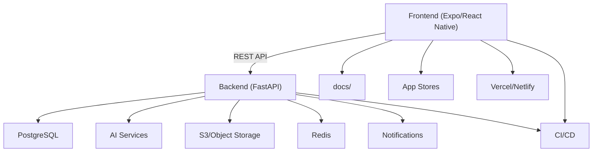

# LexiReport

LexiReport is an AI-powered document analysis platform with a modern mobile-first frontend and a robust, secure backend.

## System Overview



## Key Features
- 📱 Cross-platform mobile & web app (React Native + Expo)
- 🌓 Dark/Light mode
- 🔐 Secure authentication (JWT, RBAC)
- 📊 AI-powered report analysis, insights, and Q&A
- 🗂️ Report upload, management, and sharing
- 🔔 Notifications, offline mode, user preferences
- 🤝 Collaboration (sharing, comments, tags)

## Project Structure
```
.
├── backend/    # FastAPI backend
├── frontend/   # React Native frontend
└── docs/       # Documentation
```

## Documentation
- [Architecture](docs/ARCHITECTURE.md)
- [API Reference](docs/API_REFERENCE.md)
- [AI Implementation](docs/AI_IMPLEMENTATION_PLAN.md)
- [Deployment](docs/DEPLOYMENT.md)
- [Testing](docs/testing.md)

## Quickstart

### Backend
```bash
cd backend
python -m venv venv
source venv/bin/activate  # On Windows: venv\Scripts\activate
pip install -r requirements.txt
cp .env.template .env  # Edit .env
alembic upgrade head
uvicorn app.main:app --reload
```

### Frontend
```bash
cd frontend
npm install
npx expo start
```

## Achievements (2025)
- ✅ Modern, cross-platform frontend (Expo/React Native)
- ✅ Secure authentication (JWT, RBAC)
- ✅ Report upload, management, and AI-powered insights
- ✅ Voice-over, Q&A, and BI integration (MVP)
- ✅ Offline mode, notifications, and user preferences
- ✅ Collaboration (sharing, comments, tags)
- ✅ Robust backend (FastAPI, PostgreSQL, Alembic)
- ✅ Modular AI services (summarization, TTS, Q&A)
- ✅ CI/CD, monitoring, and scalable deployment

## License
MIT License. See the LICENSE file for details.

## Support

For support, email support@lexireport.com or open an issue in the repository.

## Project Structure
```
.
├── backend/             # FastAPI backend
├── frontend/           # React Native frontend
└── docs/              # Documentation
```

## Backend Setup

### Prerequisites
- Python 3.8+
- PostgreSQL 12+
- Virtual environment (recommended)

### Installation
1. Create and activate a virtual environment:
```bash
# Windows
python -m venv venv
venv\Scripts\activate

# Linux/Mac
python -m venv venv
source venv/bin/activate
```

2. Install dependencies:
```bash
cd backend
pip install -r requirements.txt
```

3. Configure environment variables:
Create a `.env` file in the backend directory with the following content:
```env
# PostgreSQL
POSTGRES_SERVER=localhost
POSTGRES_USER=postgres
POSTGRES_PASSWORD=your_password
POSTGRES_DB=lexireport
POSTGRES_PORT=5432

# JWT
JWT_SECRET_KEY=your_secret_key
JWT_ALGORITHM=HS256
ACCESS_TOKEN_EXPIRE_MINUTES=30

# API
API_V1_STR=/api/v1
```

4. Set up the database:
```bash
cd backend
alembic upgrade head
```

### Running the Backend Server

#### Windows
```bash
cd backend
uvicorn app.main:app --reload --host 0.0.0.0 --port 8000
```

#### Linux/Mac
```bash
cd backend
uvicorn app.main:app --reload --host 0.0.0.0 --port 8000
```

The API will be available at:
- Local: `http://localhost:8000`
- Network: `http://<your-ip-address>:8000`

API Documentation:
- Swagger UI: `http://localhost:8000/docs`
- ReDoc: `http://localhost:8000/redoc`

## Frontend Setup

### Prerequisites
- Node.js 16+
- npm or yarn

### Installation
```bash
cd frontend
npm install
```

### Running the Frontend Development Server
```bash
cd frontend
npm run dev
```

The frontend will be available at `http://localhost:5173`

## Development

### Database Migrations
```bash
# Create a new migration
alembic revision --autogenerate -m "description"

# Apply migrations
alembic upgrade head

# Rollback migrations
alembic downgrade -1
```

### Testing
```bash
# Backend tests
cd backend
pytest

# Frontend tests
cd frontend
npm test
```

## Deployment

### Backend
1. Set up a production PostgreSQL database
2. Configure environment variables for production
3. Run migrations
4. Deploy using your preferred method (e.g., Docker, cloud platform)

### Frontend
1. Build the frontend:
```bash
cd frontend
npm run build
```
2. Deploy the built files to your web server

## Documentation
Detailed documentation is available in the `docs` directory:
- [Backend Documentation](docs/backend.md)
- [Frontend Documentation](docs/frontend.md)

## Contributing
1. Fork the repository
2. Create a feature branch
3. Commit your changes
4. Push to the branch
5. Create a Pull Request

## License
This project is licensed under the MIT License - see the [LICENSE](LICENSE) file for details. 