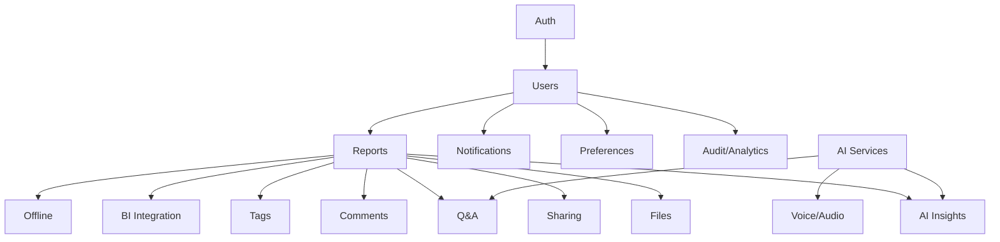

# LexiReport API Reference

## API Domains Overview



- **Solid lines**: Implemented
- **Dashed lines**: In progress or planned

## Key Endpoints (Implemented)

### Authentication
- `POST /api/v1/auth/register` — Register a new user
- `POST /api/v1/auth/login` — Login and get access token
- `POST /api/v1/auth/password-reset-request` — Request password reset
- `POST /api/v1/auth/password-reset` — Reset password with token

### Users
- `GET /api/v1/users/me` — Get current user
- `PUT /api/v1/users/me` — Update current user
- `GET /api/v1/users` — List users (admin only)
- `GET /api/v1/users/{user_id}` — Get user by ID (admin or self)
- `PUT /api/v1/users/{user_id}` — Update user (admin or self)
- `DELETE /api/v1/users/{user_id}` — Delete user (admin only)
- `PUT /api/v1/users/{user_id}/deactivate` — Deactivate user (admin only)

### Reports
- `POST /api/v1/reports/` — Create report (upload)
- `GET /api/v1/reports/` — List reports
- `GET /api/v1/reports/{report_id}` — Get report by ID
- `PUT /api/v1/reports/{report_id}` — Update report
- `DELETE /api/v1/reports/{report_id}` — Delete report
- `GET /api/v1/reports/files/{report_id}/file` — Download report file
- `GET /api/v1/reports/files/{report_id}/metadata` — Get file metadata
- `GET /api/v1/reports/types/` — List report types
- `GET /api/v1/reports/statuses/` — List report statuses
- `GET /api/v1/reports/{report_id}/versions` — Report versions

### AI Insights & Q&A
- `GET /api/v1/reports/{report_id}/insights` — List insights for a report
- `POST /api/v1/reports/{report_id}/insights` — Create a new insight
- `POST /api/v1/reports/{report_id}/query` — Ask a contextual question (Q&A)

### Voice & Audio
- `GET /api/v1/voice/profile` — Get current user's voice profile
- `POST /api/v1/voice/profile` — Create a new voice profile
- `POST /api/v1/voice/command` — Submit a voice command

### BI Integration
- `GET /api/v1/bi/connections` — List BI tool connections
- `POST /api/v1/bi/connect` — Create a new BI tool connection

### Notifications
- `GET /api/v1/notifications/` — List notifications
- `POST /api/v1/notifications/{notification_id}/read` — Mark as read
- `GET /api/v1/notifications/preferences` — Get notification preferences
- `PUT /api/v1/notifications/preferences` — Update notification preferences

### Collaboration
- `GET /api/v1/comments/report/{report_id}` — List comments for a report
- `POST /api/v1/comments/report/{report_id}` — Create a comment
- `GET /api/v1/comments/tags` — List tags
- `POST /api/v1/comments/tags` — Create a tag
- `POST /api/v1/reports/{report_id}/share` — Share a report
- `GET /api/v1/reports/{report_id}/shares` — List shares

### Offline/Processing
- `GET /api/v1/offline/content` — List offline content
- `GET /api/v1/offline/sync-queue` — List sync queue jobs
- `GET /api/v1/offline/processing-jobs` — List processing jobs

### Audit & Analytics
- `GET /api/v1/audit/logs` — List audit logs
- `GET /api/v1/audit/user-activity` — List user activity logs
- `GET /api/v1/audit/system-metrics` — List system metrics
- `GET /api/v1/audit/error-logs` — List error logs

---

## Usage Example: Create Report
```json
{
  "title": "Q1 Financial Report",
  "description": "Quarterly results",
  "report_type_id": "...",
  "metadata": {"department": "Finance"}
}
```

---

*See ARCHITECTURE.md for system diagrams and AI_IMPLEMENTATION_PLAN.md for AI pipeline details.* 