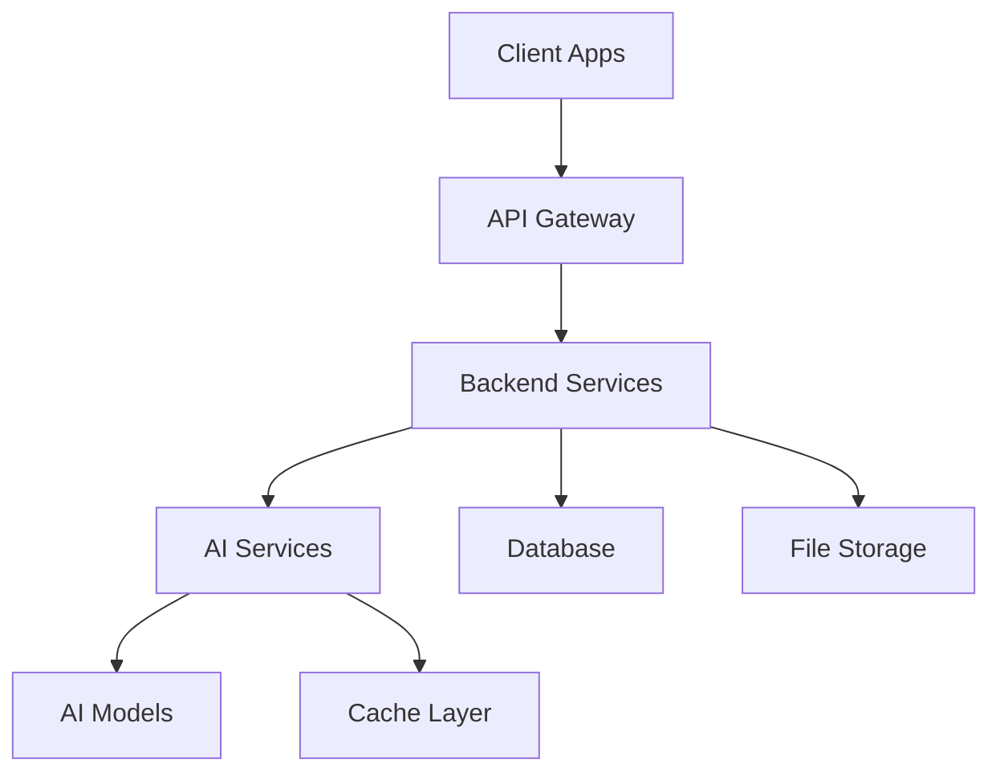
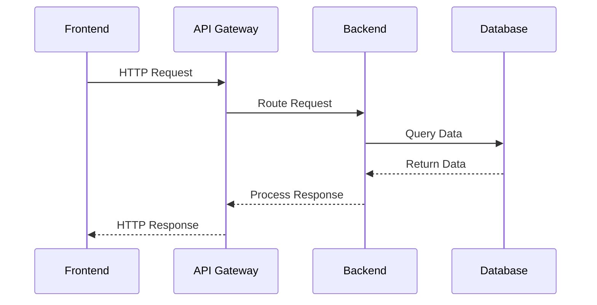
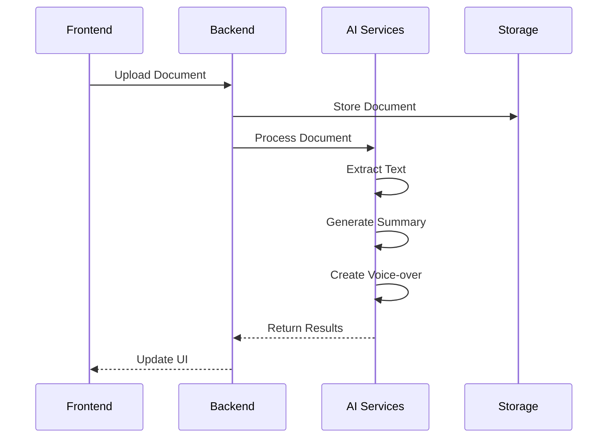
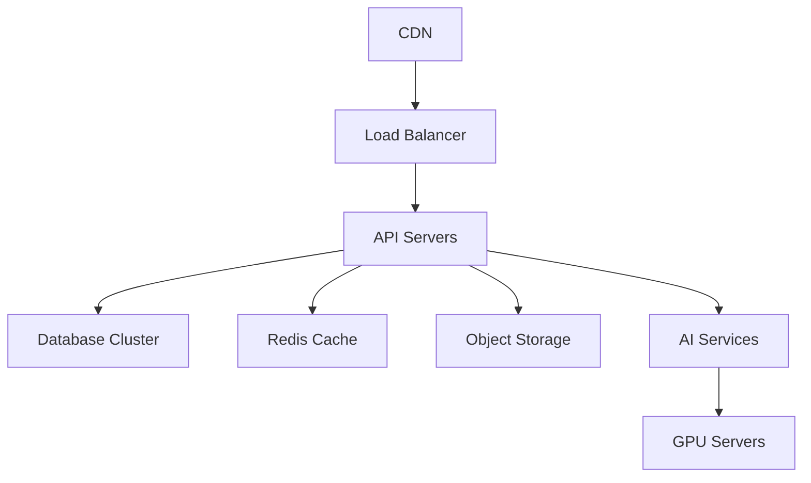
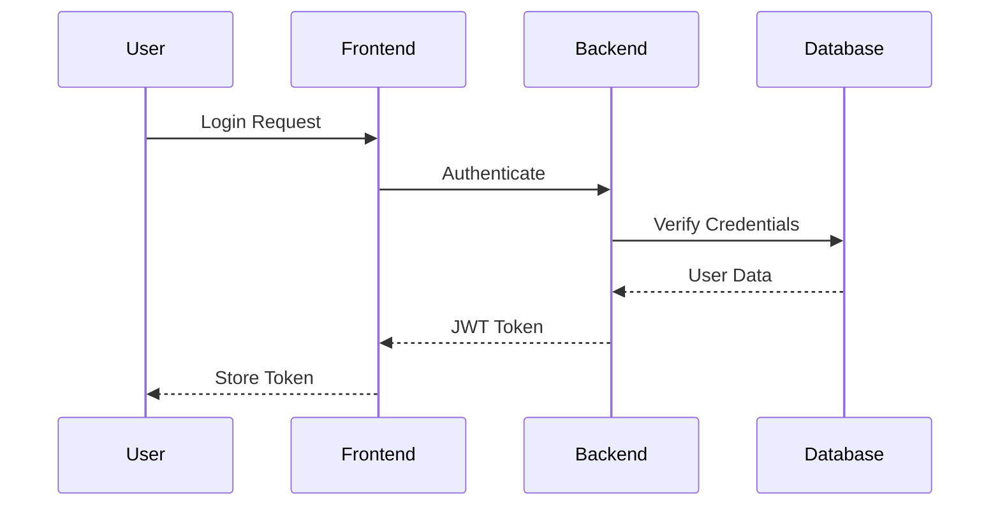

# LexiReport Architecture

## System Overview



## 1. Development Architecture

### 1.1 Frontend Architecture
```
frontend/
├── app/                    # Expo Router app directory
│   ├── (auth)/            # Authentication screens
│   ├── (tabs)/            # Main app tabs
│   └── _layout.tsx        # Root layout
├── components/            # Reusable components
│   ├── common/           # Shared components
│   ├── reports/          # Report-specific components
│   └── voice/            # Voice interaction components
├── hooks/                # Custom React hooks
├── services/            # API and external services
├── store/              # Zustand state management
├── utils/              # Helper functions
└── config/             # Configuration files
```

### 1.2 Backend Architecture
```
backend/
├── app/
│   ├── api/            # API endpoints
│   │   └── v1/        # API version 1
│   ├── core/          # Core functionality
│   ├── models/        # Database models
│   ├── schemas/       # Pydantic schemas
│   ├── services/      # Business logic
│   └── utils/         # Helper functions
├── tests/             # Test files
└── alembic/           # Database migrations
```

### 1.3 AI Services Architecture
```
backend/
└── app/
    └── services/
        └── ai/
            ├── text_extraction/    # Document processing
            ├── summarization/      # Text summarization
            ├── tts/               # Text-to-speech
            ├── voice_commands/    # Voice recognition
            └── analysis/          # Report analysis
```

## 2. Component Interactions

### 2.1 Frontend to Backend


### 2.2 AI Processing Flow


## 3. Development Environment

### 3.1 Local Development
```yaml
Development Stack:
  Frontend:
    - Node.js 16+
    - Expo CLI
    - React Native
    - TypeScript
  
  Backend:
    - Python 3.8+
    - FastAPI
    - PostgreSQL
    - Redis (Caching)
  
  AI Services:
    - PyTorch
    - Transformers
    - TTS
    - Whisper
```

### 3.2 Development Workflow
1. **Version Control**
   - Git for source control
   - Feature branch workflow
   - Pull request reviews

2. **Testing**
   - Unit tests (Jest, Pytest)
   - Integration tests
   - E2E tests (Detox)

3. **Code Quality**
   - ESLint/Prettier
   - Black/Pylint
   - Type checking
   - CI/CD pipelines

## 4. Deployment Architecture

### 4.1 Production Environment


### 4.2 Infrastructure Components

#### 4.2.1 Frontend Deployment
- **Hosting**: Vercel/Netlify
- **CDN**: Cloudflare
- **Mobile**: App Store/Play Store
- **Web**: Progressive Web App

#### 4.2.2 Backend Deployment
- **API Servers**: Kubernetes
- **Database**: Managed PostgreSQL
- **Cache**: Redis Cluster
- **Storage**: S3/Cloud Storage
- **AI Services**: GPU-enabled instances

### 4.3 Scaling Strategy

#### 4.3.1 Horizontal Scaling
- Stateless API servers
- Read replicas for database
- Multiple AI service instances

#### 4.3.2 Vertical Scaling
- GPU optimization for AI
- Database optimization
- Cache optimization

## 5. Security Architecture

### 5.1 Authentication Flow


### 5.2 Security Measures
- JWT authentication
- HTTPS encryption
- Rate limiting
- Input validation
- CORS policies
- Security headers

## 6. Monitoring and Logging

### 6.1 Monitoring Stack
- Prometheus for metrics
- Grafana for visualization
- ELK stack for logging
- Sentry for error tracking

### 6.2 Key Metrics
- API response times
- Error rates
- Resource usage
- AI processing times
- User engagement

## 7. Disaster Recovery

### 7.1 Backup Strategy
- Database backups
- File storage backups
- Configuration backups
- Regular testing

### 7.2 Recovery Procedures
- Database restoration
- Service failover
- Data recovery
- Incident response

## 8. Performance Optimization

### 8.1 Frontend
- Code splitting
- Lazy loading
- Image optimization
- Cache strategies

### 8.2 Backend
- Query optimization
- Connection pooling
- Caching layers
- Async processing

### 8.3 AI Services
- Model optimization
- Batch processing
- GPU utilization
- Result caching

## 9. Development Guidelines

### 9.1 Code Organization
- Feature-based structure
- Clear separation of concerns
- Consistent naming conventions
- Documentation requirements

### 9.2 Testing Requirements
- Unit test coverage
- Integration test scenarios
- Performance benchmarks
- Security testing

### 9.3 Documentation
- API documentation
- Component documentation
- Setup guides
- Deployment procedures 