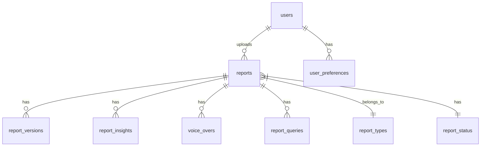

# Database Schema Design

## Overview
The database schema is designed to support all features of LexiReport, including user management, report processing, AI analysis, and voice interactions.

## Entity Relationship Diagram


## Tables

### 1. Users
```sql
CREATE TABLE users (
    id UUID PRIMARY KEY DEFAULT gen_random_uuid(),
    email VARCHAR(255) UNIQUE NOT NULL,
    full_name VARCHAR(255) NOT NULL,
    hashed_password VARCHAR(255) NOT NULL,
    is_active BOOLEAN DEFAULT true,
    is_superuser BOOLEAN DEFAULT false,
    created_at TIMESTAMP WITH TIME ZONE DEFAULT CURRENT_TIMESTAMP,
    updated_at TIMESTAMP WITH TIME ZONE DEFAULT CURRENT_TIMESTAMP
);
```

### 2. User Preferences
```sql
CREATE TABLE user_preferences (
    id UUID PRIMARY KEY DEFAULT gen_random_uuid(),
    user_id UUID REFERENCES users(id) ON DELETE CASCADE,
    theme VARCHAR(50) DEFAULT 'light',
    language VARCHAR(10) DEFAULT 'en',
    voice_preference VARCHAR(50) DEFAULT 'default',
    notification_settings JSONB DEFAULT '{}',
    created_at TIMESTAMP WITH TIME ZONE DEFAULT CURRENT_TIMESTAMP,
    updated_at TIMESTAMP WITH TIME ZONE DEFAULT CURRENT_TIMESTAMP
);
```

### 3. Report Types
```sql
CREATE TABLE report_types (
    id UUID PRIMARY KEY DEFAULT gen_random_uuid(),
    name VARCHAR(100) NOT NULL,
    description TEXT,
    supported_formats TEXT[] NOT NULL,
    created_at TIMESTAMP WITH TIME ZONE DEFAULT CURRENT_TIMESTAMP
);
```

### 4. Report Status
```sql
CREATE TABLE report_status (
    id UUID PRIMARY KEY DEFAULT gen_random_uuid(),
    name VARCHAR(50) NOT NULL,
    description TEXT,
    created_at TIMESTAMP WITH TIME ZONE DEFAULT CURRENT_TIMESTAMP
);
```

### 5. Reports
```sql
CREATE TABLE reports (
    id UUID PRIMARY KEY DEFAULT gen_random_uuid(),
    user_id UUID REFERENCES users(id) ON DELETE CASCADE,
    title VARCHAR(255) NOT NULL,
    description TEXT,
    file_path VARCHAR(512) NOT NULL,
    file_type VARCHAR(50) NOT NULL,
    file_size BIGINT NOT NULL,
    report_type_id UUID REFERENCES report_types(id),
    status_id UUID REFERENCES report_status(id),
    metadata JSONB DEFAULT '{}',
    created_at TIMESTAMP WITH TIME ZONE DEFAULT CURRENT_TIMESTAMP,
    updated_at TIMESTAMP WITH TIME ZONE DEFAULT CURRENT_TIMESTAMP
);
```

### 6. Report Versions
```sql
CREATE TABLE report_versions (
    id UUID PRIMARY KEY DEFAULT gen_random_uuid(),
    report_id UUID REFERENCES reports(id) ON DELETE CASCADE,
    version_number INTEGER NOT NULL,
    file_path VARCHAR(512) NOT NULL,
    changes_description TEXT,
    created_at TIMESTAMP WITH TIME ZONE DEFAULT CURRENT_TIMESTAMP
);
```

### 7. Report Insights
```sql
CREATE TABLE report_insights (
    id UUID PRIMARY KEY DEFAULT gen_random_uuid(),
    report_id UUID REFERENCES reports(id) ON DELETE CASCADE,
    insight_type VARCHAR(50) NOT NULL,
    content TEXT NOT NULL,
    confidence_score FLOAT,
    metadata JSONB DEFAULT '{}',
    created_at TIMESTAMP WITH TIME ZONE DEFAULT CURRENT_TIMESTAMP
);
```

### 8. Voice Overs
```sql
CREATE TABLE voice_overs (
    id UUID PRIMARY KEY DEFAULT gen_random_uuid(),
    report_id UUID REFERENCES reports(id) ON DELETE CASCADE,
    audio_path VARCHAR(512) NOT NULL,
    duration INTEGER NOT NULL,
    language VARCHAR(10) NOT NULL,
    voice_type VARCHAR(50) NOT NULL,
    status VARCHAR(50) NOT NULL,
    created_at TIMESTAMP WITH TIME ZONE DEFAULT CURRENT_TIMESTAMP,
    updated_at TIMESTAMP WITH TIME ZONE DEFAULT CURRENT_TIMESTAMP
);
```

### 9. Report Queries
```sql
CREATE TABLE report_queries (
    id UUID PRIMARY KEY DEFAULT gen_random_uuid(),
    report_id UUID REFERENCES reports(id) ON DELETE CASCADE,
    user_id UUID REFERENCES users(id) ON DELETE CASCADE,
    query_text TEXT NOT NULL,
    response_text TEXT,
    confidence_score FLOAT,
    created_at TIMESTAMP WITH TIME ZONE DEFAULT CURRENT_TIMESTAMP
);
```

### 10. Voice Commands
```sql
CREATE TABLE voice_commands (
    id UUID PRIMARY KEY DEFAULT gen_random_uuid(),
    user_id UUID REFERENCES users(id) ON DELETE CASCADE,
    command_text TEXT NOT NULL,
    action_type VARCHAR(50) NOT NULL,
    status VARCHAR(50) NOT NULL,
    metadata JSONB DEFAULT '{}',
    created_at TIMESTAMP WITH TIME ZONE DEFAULT CURRENT_TIMESTAMP
);
```

## Indexes

```sql
-- Users
CREATE INDEX idx_users_email ON users(email);

-- Reports
CREATE INDEX idx_reports_user_id ON reports(user_id);
CREATE INDEX idx_reports_status ON reports(status_id);
CREATE INDEX idx_reports_type ON reports(report_type_id);
CREATE INDEX idx_reports_created_at ON reports(created_at);

-- Report Insights
CREATE INDEX idx_report_insights_report_id ON report_insights(report_id);
CREATE INDEX idx_report_insights_type ON report_insights(insight_type);

-- Voice Overs
CREATE INDEX idx_voice_overs_report_id ON voice_overs(report_id);
CREATE INDEX idx_voice_overs_status ON voice_overs(status);

-- Report Queries
CREATE INDEX idx_report_queries_report_id ON report_queries(report_id);
CREATE INDEX idx_report_queries_user_id ON report_queries(user_id);
CREATE INDEX idx_report_queries_created_at ON report_queries(created_at);
```

## Initial Data

### Report Types
```sql
INSERT INTO report_types (name, description, supported_formats) VALUES
('Financial Report', 'Financial statements and analysis', ARRAY['pdf', 'xlsx', 'docx']),
('Performance Report', 'Performance metrics and KPIs', ARRAY['pdf', 'xlsx']),
('Research Report', 'Research findings and analysis', ARRAY['pdf', 'docx']),
('Analytics Report', 'Data analytics and insights', ARRAY['pdf', 'xlsx', 'csv']);
```

### Report Status
```sql
INSERT INTO report_status (name, description) VALUES
('uploaded', 'Report has been uploaded'),
('processing', 'Report is being processed'),
('analyzed', 'Report has been analyzed'),
('voice_generated', 'Voice-over has been generated'),
('error', 'Error occurred during processing');
```

## Database Functions

### Update Timestamp Function
```sql
CREATE OR REPLACE FUNCTION update_updated_at_column()
RETURNS TRIGGER AS $$
BEGIN
    NEW.updated_at = CURRENT_TIMESTAMP;
    RETURN NEW;
END;
$$ language 'plpgsql';
```

### Apply Update Timestamp Trigger
```sql
CREATE TRIGGER update_users_updated_at
    BEFORE UPDATE ON users
    FOR EACH ROW
    EXECUTE FUNCTION update_updated_at_column();

CREATE TRIGGER update_reports_updated_at
    BEFORE UPDATE ON reports
    FOR EACH ROW
    EXECUTE FUNCTION update_updated_at_column();

CREATE TRIGGER update_voice_overs_updated_at
    BEFORE UPDATE ON voice_overs
    FOR EACH ROW
    EXECUTE FUNCTION update_updated_at_column();
```

## Security

### Row Level Security
```sql
-- Enable RLS
ALTER TABLE reports ENABLE ROW LEVEL SECURITY;

-- Create policy
CREATE POLICY report_access_policy ON reports
    FOR ALL
    TO authenticated
    USING (user_id = auth.uid());
```

## Backup and Maintenance

### Backup Function
```sql
CREATE OR REPLACE FUNCTION backup_report_data(report_id UUID)
RETURNS void AS $$
BEGIN
    -- Implementation for backing up report data
END;
$$ LANGUAGE plpgsql;
```

## Performance Considerations

1. **Partitioning**
   - Consider partitioning the reports table by date for large deployments
   - Partition voice_overs table by status for better query performance

2. **Caching**
   - Use Redis for caching frequently accessed data
   - Cache report insights and voice-over status

3. **Archiving**
   - Implement archiving strategy for old reports
   - Move inactive data to archive tables 