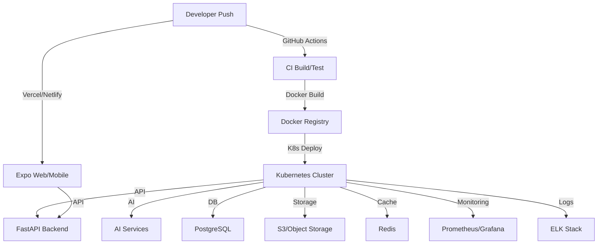

# Deployment Guide

## Overview

LexiReport uses a modern CI/CD pipeline and cloud-native deployment for both backend and frontend, with robust monitoring and rollback strategies.

## Deployment Pipeline



## Cloud Services & Environments
- **AWS/GCP/Azure**: Kubernetes, S3, RDS/PostgreSQL, GPU nodes
- **Vercel/Netlify**: Frontend web hosting
- **App Store/Play Store**: Mobile app distribution
- **Docker Hub**: Container registry
- **Prometheus/Grafana**: Monitoring
- **ELK/Sentry**: Logging & error tracking

## Monitoring & Rollback
- **Monitoring**: Prometheus, Grafana dashboards, Sentry for errors
- **Backups**: Automated DB and file storage backups
- **Rollback**: GitHub Actions and K8s support rolling deployments and rollbacks
- **Alerting**: Slack/email alerts for failures

## Achievements
- ✅ Automated CI/CD for backend and frontend
- ✅ Scalable, cloud-native deployment (K8s, Docker)
- ✅ Robust monitoring and alerting
- ✅ Easy rollback and disaster recovery

---

*See ARCHITECTURE.md for system diagrams and API_REFERENCE.md for endpoint details.*

## 1. Prerequisites

### 1.1 Required Accounts
- AWS/GCP/Azure account
- Docker Hub account
- GitHub account
- Vercel/Netlify account (for frontend)
- App Store/Play Store developer accounts

### 1.2 Required Tools
- Docker
- kubectl
- helm
- AWS CLI/GCP CLI
- Terraform (optional)

## 2. Infrastructure Setup

### 2.1 Kubernetes Cluster
```bash
# Create cluster (AWS EKS example)
eksctl create cluster \
  --name lexireport \
  --region us-west-2 \
  --nodegroup-name standard-workers \
  --node-type t3.medium \
  --nodes 3 \
  --nodes-min 1 \
  --nodes-max 4 \
  --managed
```

### 2.2 Database Setup
```bash
# Create PostgreSQL instance (AWS RDS example)
aws rds create-db-instance \
  --db-instance-identifier lexireport-db \
  --db-instance-class db.t3.medium \
  --engine postgres \
  --master-username admin \
  --master-user-password <password> \
  --allocated-storage 20
```

### 2.3 Storage Setup
```bash
# Create S3 bucket (AWS example)
aws s3 mb s3://lexireport-storage \
  --region us-west-2
```

## 3. Backend Deployment

### 3.1 Docker Image Build
```dockerfile
# backend/Dockerfile
FROM python:3.8-slim

WORKDIR /app

COPY requirements.txt .
RUN pip install --no-cache-dir -r requirements.txt

COPY . .

CMD ["uvicorn", "app.main:app", "--host", "0.0.0.0", "--port", "8000"]
```

### 3.2 Kubernetes Deployment
```yaml
# backend/k8s/deployment.yaml
apiVersion: apps/v1
kind: Deployment
metadata:
  name: lexireport-backend
spec:
  replicas: 3
  selector:
    matchLabels:
      app: lexireport-backend
  template:
    metadata:
      labels:
        app: lexireport-backend
    spec:
      containers:
      - name: backend
        image: lexireport/backend:latest
        ports:
        - containerPort: 8000
        env:
        - name: DATABASE_URL
          valueFrom:
            secretKeyRef:
              name: db-secrets
              key: url
```

### 3.3 Service Configuration
```yaml
# backend/k8s/service.yaml
apiVersion: v1
kind: Service
metadata:
  name: lexireport-backend
spec:
  selector:
    app: lexireport-backend
  ports:
  - port: 80
    targetPort: 8000
  type: LoadBalancer
```

## 4. Frontend Deployment

### 4.1 Web Deployment (Vercel)
```json
// frontend/vercel.json
{
  "version": 2,
  "builds": [
    {
      "src": "package.json",
      "use": "@vercel/static-build",
      "config": { "distDir": "dist" }
    }
  ],
  "routes": [
    { "handle": "filesystem" },
    { "src": "/.*", "dest": "/index.html" }
  ]
}
```

### 4.2 Mobile App Deployment
```bash
# Build iOS app
eas build --platform ios

# Build Android app
eas build --platform android
```

## 5. AI Services Deployment

### 5.1 GPU Node Setup
```yaml
# ai/k8s/gpu-node.yaml
apiVersion: v1
kind: Node
metadata:
  labels:
    accelerator: nvidia-tesla-t4
spec:
  taints:
  - key: nvidia.com/gpu
    operator: Exists
    effect: NoSchedule
```

### 5.2 AI Service Deployment
```yaml
# ai/k8s/deployment.yaml
apiVersion: apps/v1
kind: Deployment
metadata:
  name: lexireport-ai
spec:
  replicas: 2
  selector:
    matchLabels:
      app: lexireport-ai
  template:
    metadata:
      labels:
        app: lexireport-ai
    spec:
      containers:
      - name: ai-service
        image: lexireport/ai:latest
        resources:
          limits:
            nvidia.com/gpu: 1
```

## 6. Monitoring Setup

### 6.1 Prometheus Configuration
```yaml
# monitoring/prometheus-values.yaml
server:
  persistentVolume:
    enabled: true
  resources:
    requests:
      memory: "2Gi"
      cpu: "1"
    limits:
      memory: "4Gi"
      cpu: "2"
```

### 6.2 Grafana Dashboard
```json
// monitoring/grafana-dashboard.json
{
  "dashboard": {
    "id": null,
    "title": "LexiReport Dashboard",
    "tags": ["lexireport"],
    "timezone": "browser",
    "panels": [
      // Dashboard panels configuration
    ]
  }
}
```

## 7. CI/CD Pipeline

### 7.1 GitHub Actions Workflow
```yaml
# .github/workflows/deploy.yml
name: Deploy

on:
  push:
    branches: [ main ]

jobs:
  deploy:
    runs-on: ubuntu-latest
    steps:
    - uses: actions/checkout@v2
    
    - name: Build and Push Docker Images
      run: |
        docker build -t lexireport/backend:${{ github.sha }} ./backend
        docker push lexireport/backend:${{ github.sha }}
    
    - name: Deploy to Kubernetes
      run: |
        kubectl set image deployment/lexireport-backend \
          backend=lexireport/backend:${{ github.sha }}
```

## 8. Security Configuration

### 8.1 SSL/TLS Setup
```bash
# Install cert-manager
kubectl apply -f https://github.com/cert-manager/cert-manager/releases/download/v1.8.0/cert-manager.yaml

# Create certificate
kubectl apply -f k8s/certificate.yaml
```

### 8.2 Network Policies
```yaml
# k8s/network-policy.yaml
apiVersion: networking.k8s.io/v1
kind: NetworkPolicy
metadata:
  name: lexireport-network-policy
spec:
  podSelector:
    matchLabels:
      app: lexireport-backend
  policyTypes:
  - Ingress
  - Egress
  ingress:
  - from:
    - namespaceSelector:
        matchLabels:
          name: frontend
```

## 9. Backup and Recovery

### 9.1 Database Backup
```bash
# Automated backup script
#!/bin/bash
timestamp=$(date +%Y%m%d_%H%M%S)
pg_dump -h $DB_HOST -U $DB_USER -d $DB_NAME > backup_$timestamp.sql
aws s3 cp backup_$timestamp.sql s3://lexireport-backups/
```

### 9.2 Recovery Procedure
```bash
# Database recovery
aws s3 cp s3://lexireport-backups/backup_20230101_120000.sql .
psql -h $DB_HOST -U $DB_USER -d $DB_NAME < backup_20230101_120000.sql
```

## 10. Scaling Procedures

### 10.1 Horizontal Scaling
```bash
# Scale backend deployment
kubectl scale deployment lexireport-backend --replicas=5

# Scale AI services
kubectl scale deployment lexireport-ai --replicas=3
```

### 10.2 Vertical Scaling
```bash
# Update resource limits
kubectl patch deployment lexireport-backend -p \
  '{"spec":{"template":{"spec":{"containers":[{"name":"backend","resources":{"limits":{"cpu":"2","memory":"4Gi"}}}]}}}}'
```

## 11. Maintenance Procedures

### 11.1 Regular Updates
```bash
# Update dependencies
pip install --upgrade -r requirements.txt
npm update

# Rebuild and deploy
docker build -t lexireport/backend:latest ./backend
kubectl set image deployment/lexireport-backend backend=lexireport/backend:latest
```

### 11.2 Health Checks
```bash
# Check service health
kubectl get pods
kubectl describe pod <pod-name>
kubectl logs <pod-name>
```

## 12. Troubleshooting

### 12.1 Common Issues
1. Database connection issues
2. GPU allocation problems
3. Memory leaks
4. Network connectivity

### 12.2 Debug Procedures
```bash
# Check pod status
kubectl get pods -o wide

# Check logs
kubectl logs -f <pod-name>

# Check resource usage
kubectl top pods
kubectl top nodes
``` 