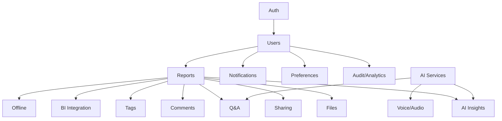
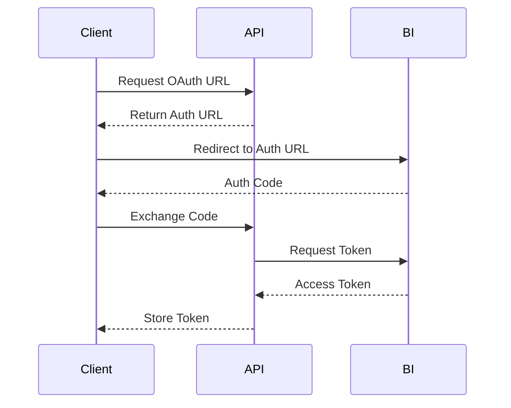

# LexiReport API Reference

## API Domains Overview



- **Solid lines**: Implemented
- **Dashed lines**: In progress or planned

## Key Endpoints (Implemented)

### Authentication
- `POST /api/v1/auth/register` — Register a new user
- `POST /api/v1/auth/login` — Login and get access token
- `POST /api/v1/auth/password-reset-request` — Request password reset
- `POST /api/v1/auth/password-reset` — Reset password with token

### Users
- `GET /api/v1/users/me` — Get current user
- `PUT /api/v1/users/me` — Update current user
- `GET /api/v1/users` — List users (admin only)
- `GET /api/v1/users/{user_id}` — Get user by ID (admin or self)
- `PUT /api/v1/users/{user_id}` — Update user (admin or self)
- `DELETE /api/v1/users/{user_id}` — Delete user (admin only)
- `PUT /api/v1/users/{user_id}/deactivate` — Deactivate user (admin only)

### Reports
- `POST /api/v1/reports/` — Create report (upload)
- `GET /api/v1/reports/` — List reports
- `GET /api/v1/reports/{report_id}` — Get report by ID
- `PUT /api/v1/reports/{report_id}` — Update report
- `DELETE /api/v1/reports/{report_id}` — Delete report
- `GET /api/v1/reports/files/{report_id}/file` — Download report file
- `GET /api/v1/reports/files/{report_id}/metadata` — Get file metadata
- `GET /api/v1/reports/types/` — List report types
- `GET /api/v1/reports/statuses/` — List report statuses
- `GET /api/v1/reports/{report_id}/versions` — Report versions

### AI Insights & Q&A
- `GET /api/v1/reports/{report_id}/insights` — List insights for a report
- `POST /api/v1/reports/{report_id}/insights` — Create a new insight
- `POST /api/v1/reports/{report_id}/query` — Ask a contextual question (Q&A)

### Voice & Audio
- `GET /api/v1/voice/profile` — Get current user's voice profile
- `POST /api/v1/voice/profile` — Create a new voice profile
- `POST /api/v1/voice/command` — Submit a voice command

### BI Integration
- `GET /api/v1/bi/connections` — List BI tool connections
- `POST /api/v1/bi/connect` — Create a new BI tool connection

### Notifications
- `GET /api/v1/notifications/` — List notifications
- `POST /api/v1/notifications/{notification_id}/read` — Mark as read
- `GET /api/v1/notifications/preferences` — Get notification preferences
- `PUT /api/v1/notifications/preferences` — Update notification preferences

### Collaboration
- `GET /api/v1/comments/report/{report_id}` — List comments for a report
- `POST /api/v1/comments/report/{report_id}` — Create a comment
- `GET /api/v1/comments/tags` — List tags
- `POST /api/v1/comments/tags` — Create a tag
- `POST /api/v1/reports/{report_id}/share` — Share a report
- `GET /api/v1/reports/{report_id}/shares` — List shares

### Offline/Processing
- `GET /api/v1/offline/content` — List offline content
- `GET /api/v1/offline/sync-queue` — List sync queue jobs
- `GET /api/v1/offline/processing-jobs` — List processing jobs

### Audit & Analytics
- `GET /api/v1/audit/logs` — List audit logs
- `GET /api/v1/audit/user-activity` — List user activity logs
- `GET /api/v1/audit/system-metrics` — List system metrics
- `GET /api/v1/audit/error-logs` — List error logs

---

## Usage Example: Create Report
```json
{
  "title": "Q1 Financial Report",
  "description": "Quarterly results",
  "report_type_id": "...",
  "metadata": {"department": "Finance"}
}
```

---

*See ARCHITECTURE.md for system diagrams and AI_IMPLEMENTATION_PLAN.md for AI pipeline details.* 

## API Reference

## Overview

This document provides detailed information about the LexiReport API endpoints, request/response formats, and authentication requirements.

## Base URL

```
https://api.lexireport.com/v1
```

## Authentication

### JWT Authentication

All API requests require a valid JWT token in the Authorization header:

```http
Authorization: Bearer <your_jwt_token>
```

### OAuth 2.0 for BI Integration

For BI platform integrations (PowerBI, Tableau, Google Data Studio), OAuth 2.0 is used:



## API Endpoints

### Authentication

#### Register User

```http
POST /auth/register
```

**Request Body:**
```json
{
    "email": "user@example.com",
    "password": "secure_password",
    "name": "John Doe"
}
```

**Response:**
```json
{
    "id": "user_id",
    "email": "user@example.com",
    "name": "John Doe",
    "token": "jwt_token"
}
```

#### Login

```http
POST /auth/login
```

**Request Body:**
```json
{
    "email": "user@example.com",
    "password": "secure_password"
}
```

**Response:**
```json
{
    "id": "user_id",
    "email": "user@example.com",
    "name": "John Doe",
    "token": "jwt_token"
}
```

### Reports

#### Upload Report

```http
POST /reports/upload
```

**Request Body:**
```multipart/form-data
file: <file>
type: "pdf" | "excel"
```

**Response:**
```json
{
    "id": "report_id",
    "status": "processing",
    "message": "Report is being processed"
}
```

#### Get Report Status

```http
GET /reports/{report_id}/status
```

**Response:**
```json
{
    "id": "report_id",
    "status": "completed",
    "progress": 100,
    "insights": {
        "summary": "Report summary...",
        "key_points": ["Point 1", "Point 2"],
        "trends": ["Trend 1", "Trend 2"]
    }
}
```

#### Get Report Insights

```http
GET /reports/{report_id}/insights
```

**Response:**
```json
{
    "id": "report_id",
    "insights": {
        "summary": "Report summary...",
        "key_points": ["Point 1", "Point 2"],
        "trends": ["Trend 1", "Trend 2"],
        "sentiment": "positive",
        "recommendations": ["Rec 1", "Rec 2"]
    }
}
```

### BI Integration

#### Connect BI Platform

```http
POST /bi/connect
```

**Request Body:**
```json
{
    "platform": "powerbi" | "tableau" | "gds",
    "auth_code": "oauth_code"
}
```

**Response:**
```json
{
    "status": "connected",
    "platform": "powerbi",
    "token": "encrypted_token"
}
```

#### Get BI Reports

```http
GET /bi/{platform}/reports
```

**Response:**
```json
{
    "reports": [
        {
            "id": "report_id",
            "name": "Report Name",
            "type": "dashboard" | "report",
            "last_updated": "2024-02-08T12:00:00Z"
        }
    ]
}
```

### Voice Features

#### Generate Voice-over

```http
POST /voice/generate
```

**Request Body:**
```json
{
    "text": "Text to convert to speech",
    "voice": "en-US" | "en-GB",
    "speed": 1.0
}
```

**Response:**
```json
{
    "audio_url": "https://api.lexireport.com/audio/123.mp3",
    "duration": 120,
    "format": "mp3"
}
```

### User Management

#### Get User Profile

```http
GET /users/profile
```

**Response:**
```json
{
    "id": "user_id",
    "email": "user@example.com",
    "name": "John Doe",
    "preferences": {
        "voice": "en-US",
        "theme": "light",
        "notifications": true
    }
}
```

#### Update User Profile

```http
PUT /users/profile
```

**Request Body:**
```json
{
    "name": "John Doe",
    "preferences": {
        "voice": "en-GB",
        "theme": "dark",
        "notifications": false
    }
}
```

**Response:**
```json
{
    "id": "user_id",
    "email": "user@example.com",
    "name": "John Doe",
    "preferences": {
        "voice": "en-GB",
        "theme": "dark",
        "notifications": false
    }
}
```

## WebSocket API

### Real-time Updates

```http
WebSocket: wss://api.lexireport.com/v1/ws
```

**Connection Headers:**
```http
Authorization: Bearer <your_jwt_token>
```

**Message Types:**

1. Report Processing Updates:
```json
{
    "type": "report_status",
    "data": {
        "report_id": "report_id",
        "status": "processing",
        "progress": 75
    }
}
```

2. BI Sync Updates:
```json
{
    "type": "bi_sync",
    "data": {
        "platform": "powerbi",
        "status": "syncing",
        "progress": 50
    }
}
```

## Error Handling

### Error Response Format

```json
{
    "error": {
        "code": "ERROR_CODE",
        "message": "Human readable error message",
        "details": {
            "field": "Additional error details"
        }
    }
}
```

### Common Error Codes

| Code | Description |
|------|-------------|
| `AUTH_REQUIRED` | Authentication required |
| `INVALID_TOKEN` | Invalid or expired token |
| `INVALID_REQUEST` | Invalid request parameters |
| `NOT_FOUND` | Resource not found |
| `PROCESSING_ERROR` | Error during processing |
| `RATE_LIMITED` | Too many requests |

## Rate Limiting

- 100 requests per minute for authenticated users
- 20 requests per minute for unauthenticated users
- Rate limit headers included in responses:
  - `X-RateLimit-Limit`
  - `X-RateLimit-Remaining`
  - `X-RateLimit-Reset`

## Versioning

API versioning is handled through the URL path:
- Current version: `/v1`
- Future versions: `/v2`, `/v3`, etc.

## Data Formats

### Date/Time
- ISO 8601 format: `YYYY-MM-DDTHH:mm:ssZ`

### File Types
- PDF: `application/pdf`
- Excel: `application/vnd.openxmlformats-officedocument.spreadsheetml.sheet`

### Audio Formats
- MP3: `audio/mpeg`
- WAV: `audio/wav`

## Best Practices

1. **Error Handling**
   - Always check for error responses
   - Implement retry logic for transient errors
   - Handle rate limiting appropriately

2. **Authentication**
   - Store tokens securely
   - Implement token refresh logic
   - Handle token expiration gracefully

3. **File Uploads**
   - Use multipart/form-data for file uploads
   - Implement progress tracking
   - Handle large files appropriately

4. **Real-time Updates**
   - Implement WebSocket reconnection logic
   - Handle connection errors gracefully
   - Process messages in order

## SDK Support

Official SDKs are available for:
- JavaScript/TypeScript
- Python
- Java
- .NET

See the [SDK Documentation](SDK.md) for more details. 