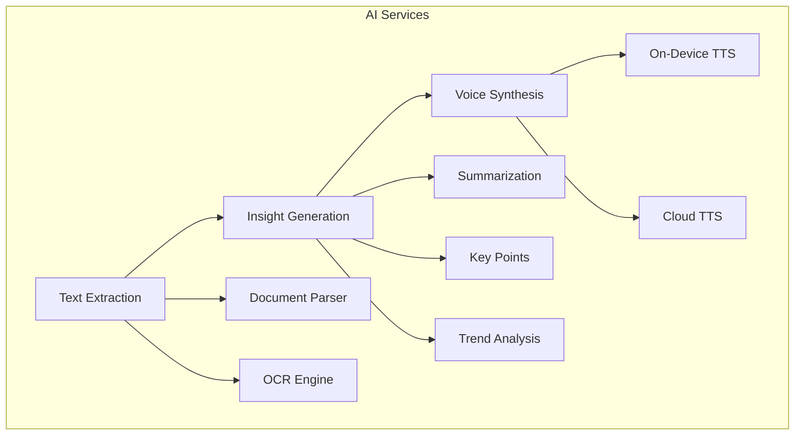
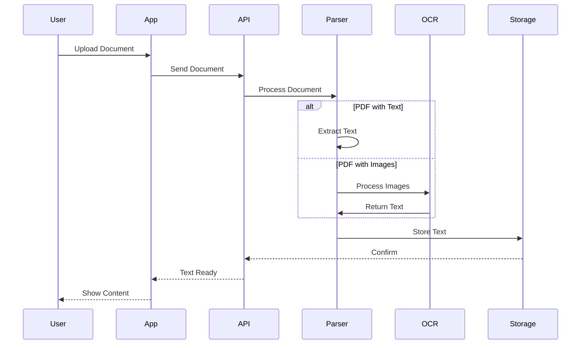
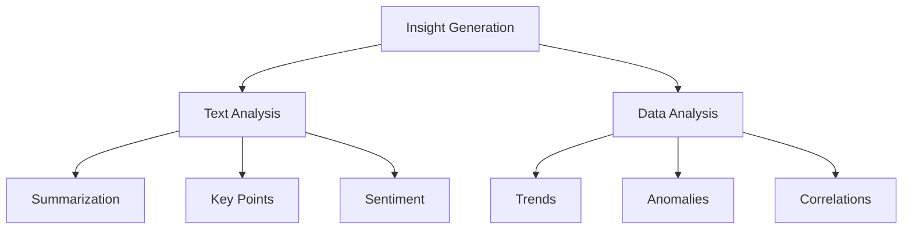
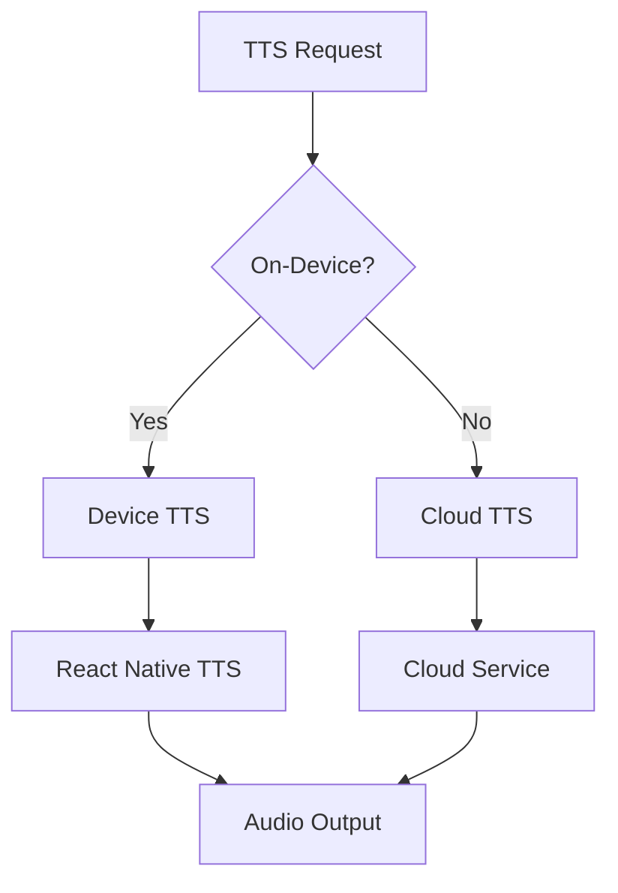
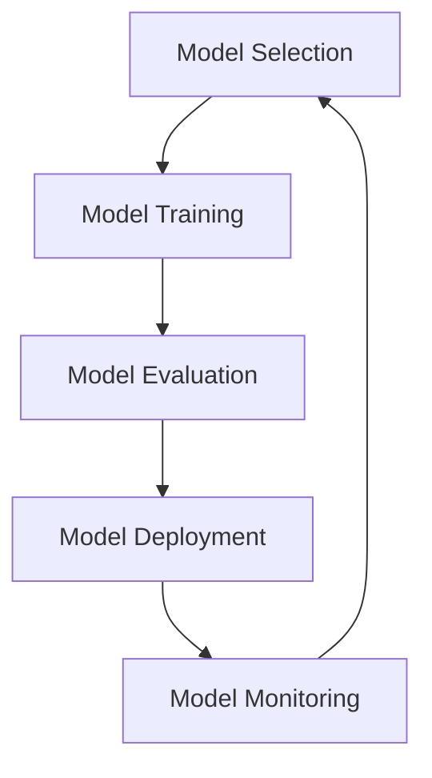
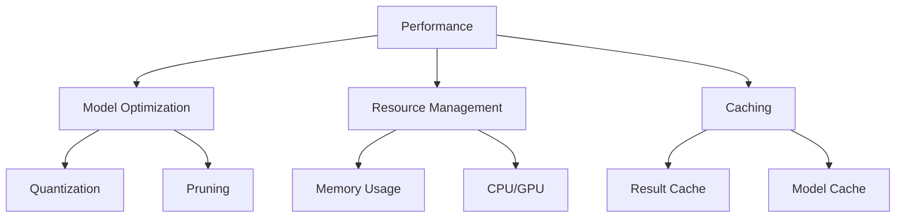
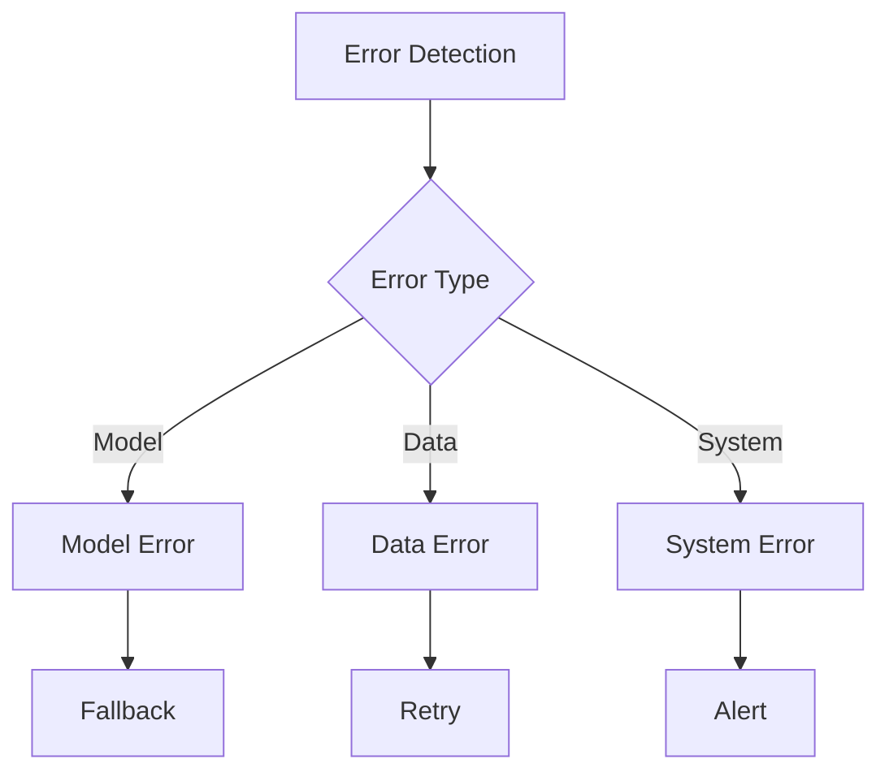
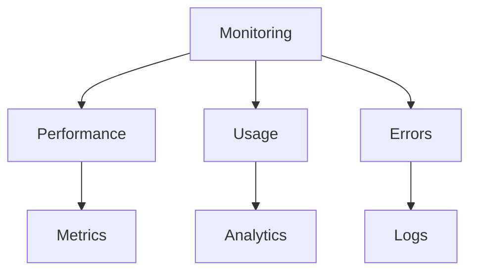
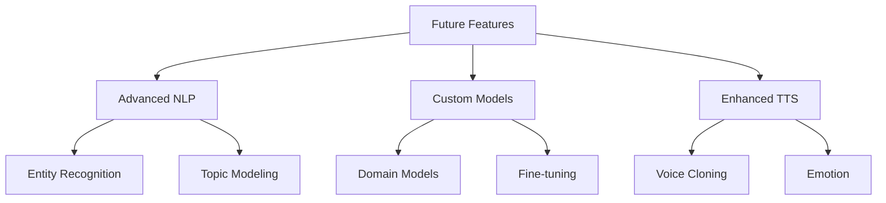

# AI Implementation Plan

## Overview

This document outlines the AI implementation strategy for LexiReport, focusing on text extraction, insight generation, and voice synthesis capabilities.

## AI Components



## 1. Text Extraction Pipeline

### 1.1 Document Processing



### 1.2 Implementation Details

- **PDF Processing**
  - PyPDF2 for basic text extraction
  - pdfplumber for complex layouts
  - Camelot for table extraction
  - Tesseract OCR for image-based PDFs

- **Excel Processing**
  - pandas for data extraction
  - openpyxl for formatting
  - Custom table structure detection

## 2. Insight Generation

### 2.1 Insight Types



### 2.2 Implementation Details

- **Text Analysis**
  - Hugging Face Transformers for summarization
  - spaCy for NLP tasks
  - NLTK for text processing
  - Custom keyword extraction

- **Data Analysis**
  - pandas for data manipulation
  - scikit-learn for ML tasks
  - statsmodels for statistical analysis
  - Custom trend detection

## 3. Voice Synthesis

### 3.1 TTS Architecture



### 3.2 Implementation Details

- **On-Device TTS**
  - React Native TTS integration
  - Voice selection and configuration
  - Audio caching and management
  - Background playback support

- **Cloud TTS (Fallback)**
  - AWS Polly integration
  - Google Cloud TTS
  - Azure TTS
  - Custom voice models

## 4. AI Model Management

### 4.1 Model Pipeline



### 4.2 Implementation Details

- **Model Selection**
  - Performance metrics
  - Resource requirements
  - Deployment constraints
  - Cost considerations

- **Model Training**
  - Data preprocessing
  - Training pipeline
  - Validation process
  - Model optimization

- **Model Deployment**
  - Containerization
  - API endpoints
  - Version control
  - Rollback procedures

## 5. Performance Optimization

### 5.1 Optimization Strategies



### 5.2 Implementation Details

- **Model Optimization**
  - ONNX conversion
  - Model quantization
  - Layer pruning
  - Batch processing

- **Resource Management**
  - Memory optimization
  - CPU/GPU utilization
  - Parallel processing
  - Load balancing

## 6. Error Handling

### 6.1 Error Management



### 6.2 Implementation Details

- **Error Types**
  - Model inference errors
  - Data processing errors
  - System resource errors
  - Network errors

- **Error Handling**
  - Fallback mechanisms
  - Retry strategies
  - Error logging
  - Alert systems

## 7. Monitoring and Analytics

### 7.1 Monitoring System



### 7.2 Implementation Details

- **Performance Monitoring**
  - Response times
  - Resource usage
  - Model accuracy
  - System health

- **Usage Analytics**
  - Feature usage
  - User patterns
  - Error rates
  - Success metrics

## 8. Future Enhancements

### 8.1 Planned Features



### 8.2 Implementation Roadmap

- **Short Term**
  - Basic text extraction
  - Simple insights
  - On-device TTS
  - Cloud fallback

- **Medium Term**
  - Advanced NLP
  - Custom models
  - Enhanced TTS
  - Performance optimization

- **Long Term**
  - Voice cloning
  - Emotion detection
  - Real-time analysis
  - Advanced features

## AI Pipeline Overview

```mermaid
graph TD
    A[Document Upload] --> B[Text Extraction (pdfplumber, docx, openpyxl)]
    B --> C[Summarization (BART-large-cnn)]
    C --> D[AI Insights]
    C --> E[Text-to-Speech (Coqui TTS)]
    C --> F[Document Classification (DistilBERT)]
    C --> G[Entity Extraction (spaCy)]
    C --> H[Q&A (Roberta SQuAD2)]
    D --> I[Voice-over Generation]
    E --> I
    F --> D
    G --> D
    H --> D
    J[Voice Command (Whisper)] --> K[Command Processing (spaCy, transformers)]
    K --> L[Action Execution]
```

- **Solid lines**: Implemented
- **Dashed lines**: In progress or planned

## Achievements (2024)
- ✅ Text extraction for PDF, Word, Excel
- ✅ Summarization (BART)
- ✅ Text-to-speech (Coqui TTS)
- ✅ Voice command (Whisper)
- ✅ Q&A (Roberta SQuAD2)
- ✅ Entity extraction (spaCy)
- ✅ Document classification (DistilBERT)
- ✅ Modular AI service endpoints

## Implementation Phases

### Phase 1: Core AI Features (Complete)
- Text extraction, summarization, TTS, basic voice command

### Phase 2: Advanced Features (In Progress)
- Document classification, entity extraction, advanced Q&A, enhanced voice command

### Phase 3: Integration & Optimization (Planned)
- Full integration, performance optimization, error handling, caching

## Technical Stack
- **Transformers** (Hugging Face)
- **PyTorch**
- **spaCy**
- **Coqui TTS**
- **Whisper**
- **pdfplumber, python-docx, openpyxl**

## API Endpoints (AI)
- `POST /api/v1/reports/{report_id}/generate-voice` — Generate voice-over
- `POST /api/v1/voice/command` — Submit voice command
- `POST /api/v1/reports/{report_id}/analyze` — Analyze report
- `POST /api/v1/reports/{report_id}/query` — Q&A

## Next Steps
- 🟡 Optimize performance and caching
- 🟡 Add custom voice model support
- 🟡 Expand multi-language support
- 🟡 Enhance real-time collaboration

---

*See ARCHITECTURE.md for system diagrams and API_REFERENCE.md for endpoint details.*

## 1. Voice-Over Generation System

### Components:
1. **Text Extraction**
   - Use `pdfplumber` for PDF documents
   - `python-docx` for Word documents
   - `openpyxl` for Excel files

2. **Text Summarization**
   - Model: `facebook/bart-large-cnn` (Hugging Face)
   - Purpose: Generate concise summaries of reports
   - Implementation:
     ```python
     from transformers import pipeline
     summarizer = pipeline("summarization", model="facebook/bart-large-cnn")
     ```

3. **Text-to-Speech**
   - Model: `coqui-ai/TTS` (Open Source)
   - Features:
     - Multiple voice options
     - Natural-sounding speech
     - Support for multiple languages
   - Implementation:
     ```python
     from TTS.api import TTS
     tts = TTS(model_name="tts_models/en/ljspeech/tacotron2-DDC")
     ```

## 2. Voice Command System

### Components:
1. **Speech Recognition**
   - Model: `whisper` (OpenAI's open-source model)
   - Features:
     - High accuracy
     - Multiple language support
     - Real-time processing
   - Implementation:
     ```python
     import whisper
     model = whisper.load_model("base")
     ```

2. **Command Processing**
   - Use `spacy` for NLP processing
   - Intent classification using `transformers`
   - Implementation:
     ```python
     import spacy
     nlp = spacy.load("en_core_web_sm")
     ```

## 3. Report Analysis System

### Components:
1. **Document Classification**
   - Model: `distilbert-base-uncased` (Hugging Face)
   - Purpose: Categorize reports by type and content
   - Implementation:
     ```python
     from transformers import pipeline
     classifier = pipeline("text-classification", model="distilbert-base-uncased")
     ```

2. **Entity Extraction**
   - Model: `spacy` with custom training
   - Purpose: Extract key metrics, dates, and entities
   - Implementation:
     ```python
     import spacy
     nlp = spacy.load("en_core_web_trf")
     ```

3. **Question Answering**
   - Model: `deepset/roberta-base-squad2` (Hugging Face)
   - Purpose: Answer user queries about report content
   - Implementation:
     ```python
     from transformers import pipeline
     qa_pipeline = pipeline("question-answering", model="deepset/roberta-base-squad2")
     ```

## 4. Implementation Phases

### Phase 1: Core AI Features (2-3 weeks)
1. Set up basic text extraction
2. Implement text summarization
3. Add text-to-speech conversion
4. Create basic voice command recognition

### Phase 2: Advanced Features (3-4 weeks)
1. Implement document classification
2. Add entity extraction
3. Set up question-answering system
4. Enhance voice command processing

### Phase 3: Integration & Optimization (2-3 weeks)
1. Integrate all AI components
2. Optimize performance
3. Add caching and batch processing
4. Implement error handling and fallbacks

## 5. Technical Requirements

### Backend Dependencies
```python
# requirements.txt additions
transformers==4.30.0
torch==2.0.1
spacy==3.5.3
TTS==0.13.3
whisper==1.1.10
pdfplumber==0.7.6
python-docx==0.8.11
openpyxl==3.1.2
```

### System Requirements
- GPU recommended for faster processing
- Minimum 8GB RAM
- 20GB free disk space for models

## 6. API Endpoints

### New Endpoints to Implement
```python
# Voice Generation
POST /api/v1/reports/{report_id}/generate-voice
GET /api/v1/reports/{report_id}/voice-status

# Voice Commands
POST /api/v1/voice/command
GET /api/v1/voice/command-history

# Report Analysis
POST /api/v1/reports/{report_id}/analyze
GET /api/v1/reports/{report_id}/insights
POST /api/v1/reports/{report_id}/query
```

## 7. Testing Strategy

### Unit Tests
- Test each AI component individually
- Mock external API calls
- Test error handling

### Integration Tests
- Test complete voice generation pipeline
- Test voice command system
- Test report analysis system

### Performance Tests
- Load testing for concurrent requests
- Response time benchmarks
- Resource usage monitoring

## 8. Monitoring and Maintenance

### Metrics to Track
- Voice generation success rate
- Command recognition accuracy
- Response times
- Resource usage
- Error rates

### Maintenance Tasks
- Regular model updates
- Performance optimization
- Error log analysis
- User feedback integration

## 9. Future Enhancements

### Planned Features
1. Custom voice model training
2. Advanced report visualization
3. Multi-language support
4. Offline processing capabilities
5. Real-time collaboration features

## 10. Security Considerations

### Data Protection
- Encrypt stored voice data
- Secure API endpoints
- Implement rate limiting
- Regular security audits

### Privacy Compliance
- GDPR compliance
- Data retention policies
- User consent management
- Data anonymization 