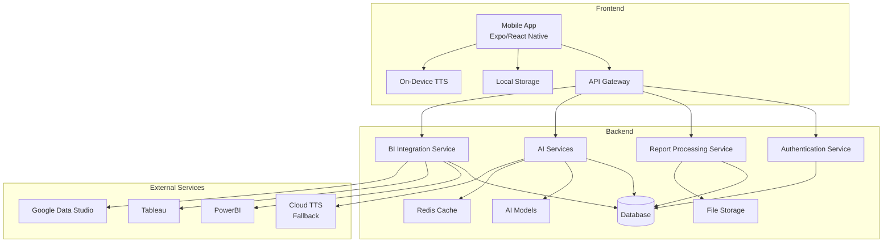
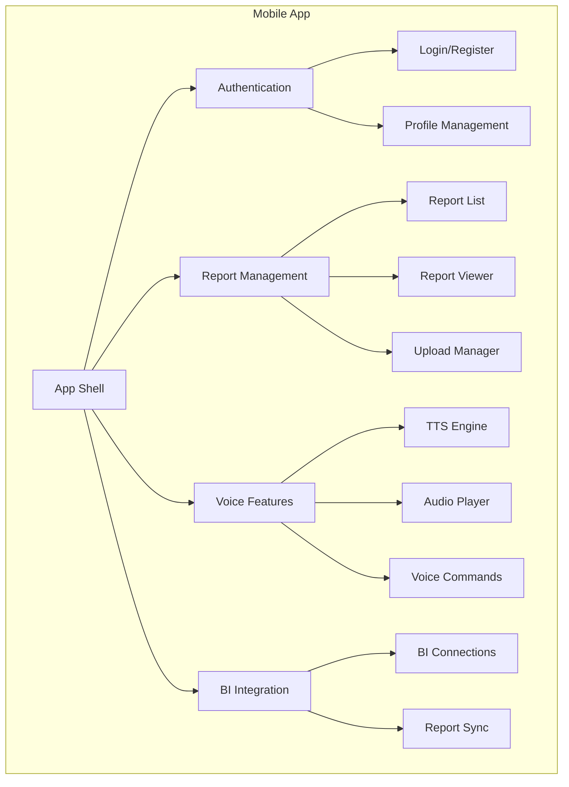
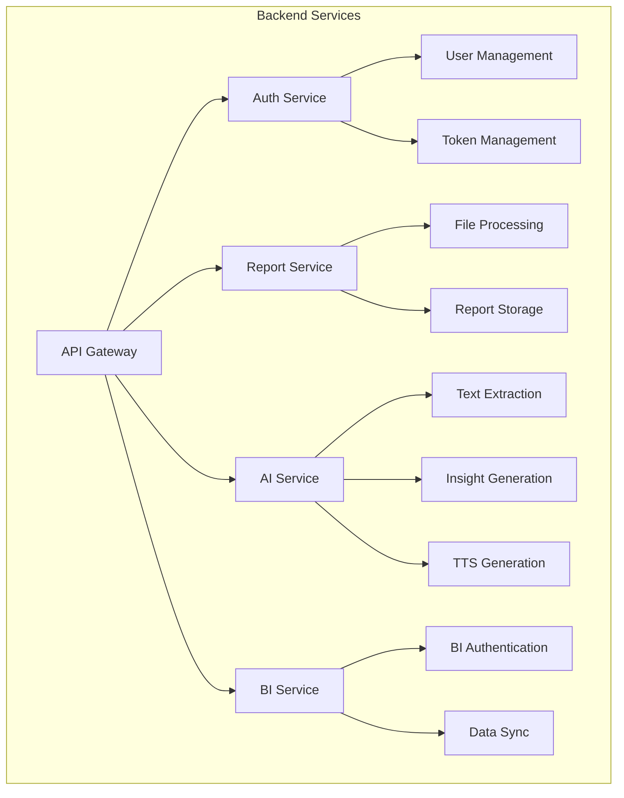
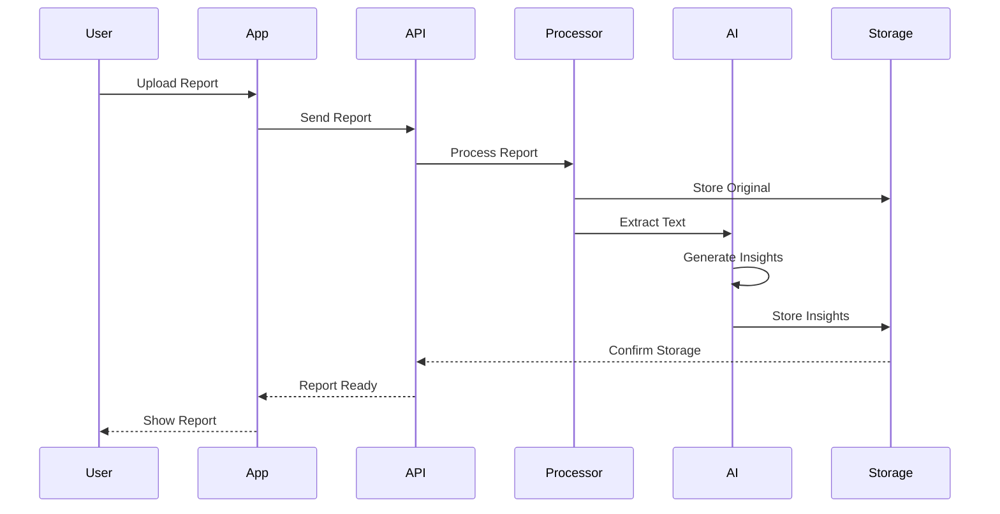
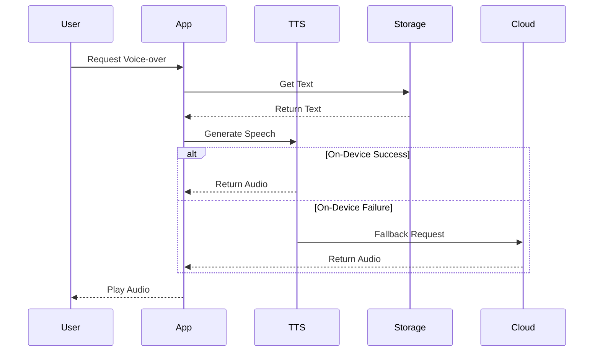
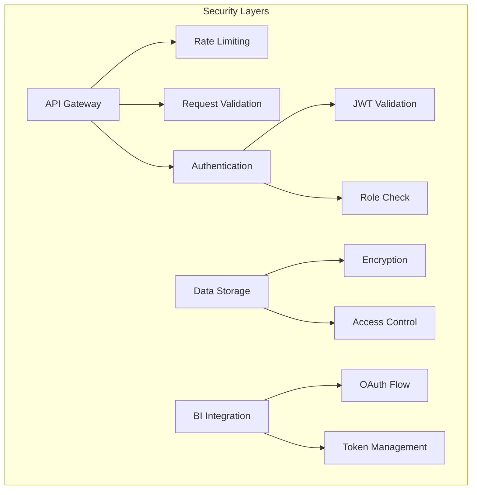
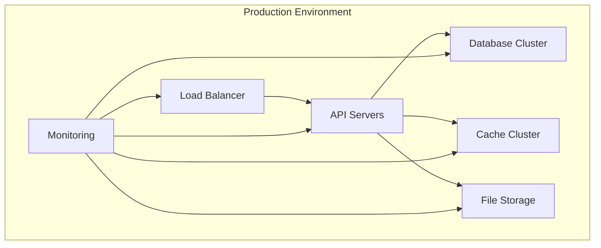

# System Architecture

## High-Level System Architecture

## Component Architecture

### Frontend Components

### Backend Services

## Data Flow Architecture

### Report Processing Flow

### Voice Generation Flow

## Security Architecture

## Deployment Architecture

## Technology Stack

### Frontend
- **Framework**: Expo/React Native
- **State Management**: Zustand
- **Navigation**: React Navigation
- **UI Components**: React Native Paper
- **Local Storage**: SQLite, AsyncStorage
- **TTS**: React Native TTS

### Backend
- **Framework**: FastAPI
- **Database**: PostgreSQL
- **Cache**: Redis
- **File Storage**: S3/GCS
- **Task Queue**: Celery
- **AI/ML**: PyTorch, Transformers

### DevOps
- **Containerization**: Docker
- **Orchestration**: Kubernetes
- **CI/CD**: GitHub Actions
- **Monitoring**: Prometheus, Grafana
- **Logging**: ELK Stack

## Scalability Considerations

1. **Horizontal Scaling**
   - Stateless API servers
   - Database read replicas
   - Distributed caching
   - Load balancing

2. **Performance Optimization**
   - Response caching
   - Database indexing
   - Query optimization
   - Asset optimization

3. **High Availability**
   - Multi-region deployment
   - Database replication
   - Failover mechanisms
   - Backup strategies

## Security Measures

1. **Authentication & Authorization**
   - JWT-based authentication
   - Role-based access control
   - OAuth 2.0 for BI integration
   - Secure token storage

2. **Data Protection**
   - End-to-end encryption
   - Secure file storage
   - Data backup
   - Access logging

3. **API Security**
   - Rate limiting
   - Input validation
   - CORS policies
   - Security headers

## Monitoring & Logging

1. **Application Monitoring**
   - Performance metrics
   - Error tracking
   - User analytics
   - Resource usage

2. **Infrastructure Monitoring**
   - Server health
   - Network metrics
   - Database performance
   - Cache hit rates

3. **Logging**
   - Application logs
   - Access logs
   - Error logs
   - Audit trails 