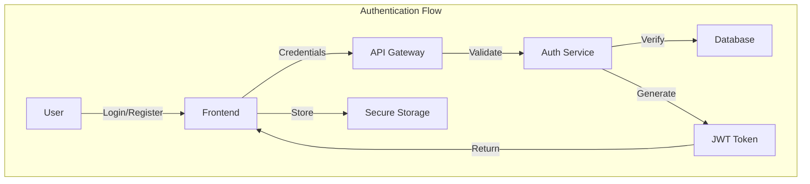
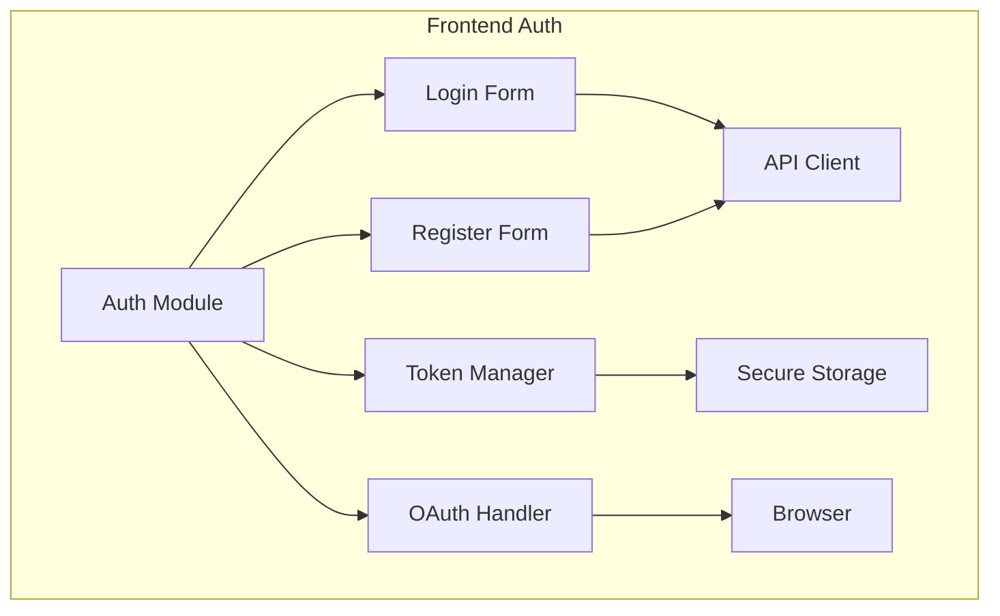
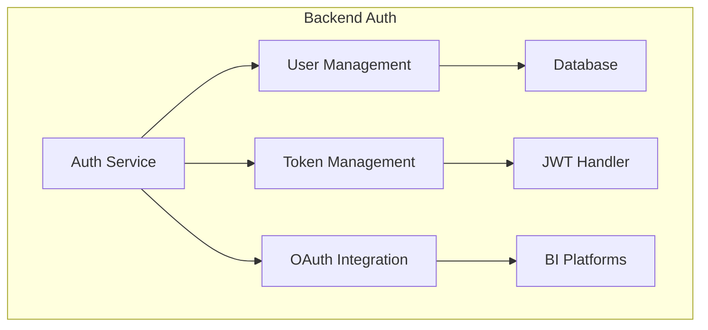
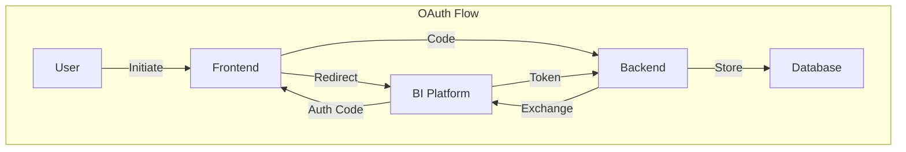
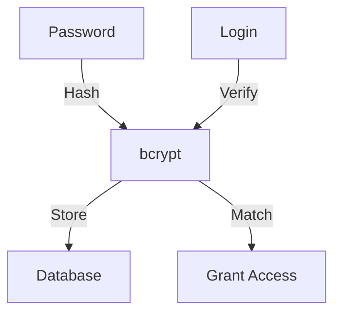
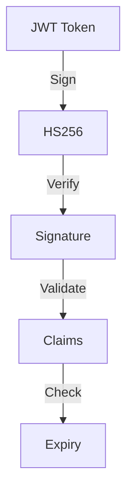
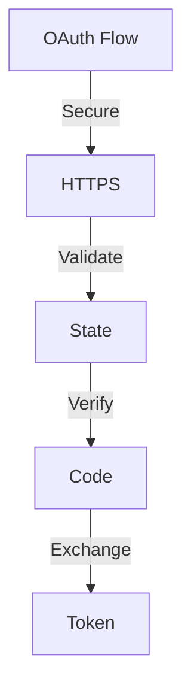
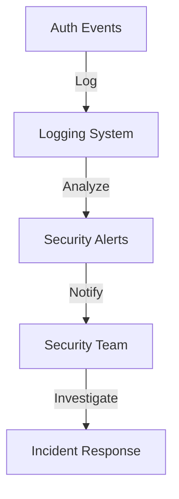

# Authentication System

## Overview

The LexiReport authentication system provides secure user authentication and authorization using JWT tokens and OAuth 2.0 for third-party integrations.

## Architecture



## Components

### 1. Frontend Authentication



#### Implementation

```typescript
// frontend/services/auth.ts
import { create } from 'zustand';
import { persist } from 'zustand/middleware';

interface AuthState {
  token: string | null;
  user: User | null;
  login: (email: string, password: string) => Promise<void>;
  logout: () => void;
}

export const useAuth = create<AuthState>()(
  persist(
    (set) => ({
      token: null,
      user: null,
      login: async (email, password) => {
        const response = await api.post('/auth/login', { email, password });
        set({ token: response.data.token, user: response.data.user });
      },
      logout: () => set({ token: null, user: null }),
    }),
    {
      name: 'auth-storage',
    }
  )
);
```

### 2. Backend Authentication



#### Implementation

```python
# backend/app/services/auth.py
from datetime import datetime, timedelta
from typing import Optional
from jose import JWTError, jwt
from passlib.context import CryptContext

class AuthService:
    def __init__(self):
        self.pwd_context = CryptContext(schemes=["bcrypt"], deprecated="auto")
        self.SECRET_KEY = "your-secret-key"
        self.ALGORITHM = "HS256"
        self.ACCESS_TOKEN_EXPIRE_MINUTES = 30

    def verify_password(self, plain_password: str, hashed_password: str) -> bool:
        return self.pwd_context.verify(plain_password, hashed_password)

    def get_password_hash(self, password: str) -> str:
        return self.pwd_context.hash(password)

    def create_access_token(self, data: dict, expires_delta: Optional[timedelta] = None):
        to_encode = data.copy()
        if expires_delta:
            expire = datetime.utcnow() + expires_delta
        else:
            expire = datetime.utcnow() + timedelta(minutes=15)
        to_encode.update({"exp": expire})
        encoded_jwt = jwt.encode(to_encode, self.SECRET_KEY, algorithm=self.ALGORITHM)
        return encoded_jwt
```

### 3. OAuth Integration



#### Implementation

```python
# backend/app/services/oauth.py
from typing import Dict
import httpx

class OAuthService:
    def __init__(self):
        self.clients = {
            "powerbi": {
                "client_id": "your-client-id",
                "client_secret": "your-client-secret",
                "auth_url": "https://login.microsoftonline.com/common/oauth2/v2.0/authorize",
                "token_url": "https://login.microsoftonline.com/common/oauth2/v2.0/token",
            },
            "tableau": {
                "client_id": "your-client-id",
                "client_secret": "your-client-secret",
                "auth_url": "https://online.tableau.com/oauth2/authorize",
                "token_url": "https://online.tableau.com/oauth2/token",
            }
        }

    async def get_auth_url(self, platform: str) -> str:
        client = self.clients[platform]
        return f"{client['auth_url']}?client_id={client['client_id']}&response_type=code"

    async def exchange_code(self, platform: str, code: str) -> Dict:
        client = self.clients[platform]
        async with httpx.AsyncClient() as http_client:
            response = await http_client.post(
                client["token_url"],
                data={
                    "grant_type": "authorization_code",
                    "code": code,
                    "client_id": client["client_id"],
                    "client_secret": client["client_secret"],
                }
            )
            return response.json()
```

## Security Measures

### 1. Password Security



### 2. Token Security



### 3. OAuth Security



## API Endpoints

### 1. Authentication

```http
POST /api/v1/auth/register
Content-Type: application/json

{
    "email": "user@example.com",
    "password": "secure_password",
    "name": "John Doe"
}
```

```http
POST /api/v1/auth/login
Content-Type: application/json

{
    "email": "user@example.com",
    "password": "secure_password"
}
```

### 2. OAuth

```http
GET /api/v1/oauth/{platform}/authorize
```

```http
POST /api/v1/oauth/{platform}/callback
Content-Type: application/json

{
    "code": "oauth_code"
}
```

## Error Handling

### 1. Authentication Errors

```json
{
    "error": {
        "code": "AUTH_ERROR",
        "message": "Invalid credentials",
        "details": {
            "field": "password"
        }
    }
}
```

### 2. OAuth Errors

```json
{
    "error": {
        "code": "OAUTH_ERROR",
        "message": "Failed to exchange code",
        "details": {
            "platform": "powerbi",
            "reason": "expired_code"
        }
    }
}
```

## Best Practices

1. **Password Security**
   - Use strong password hashing (bcrypt)
   - Implement password complexity requirements
   - Regular password rotation
   - Secure password reset flow

2. **Token Management**
   - Short-lived access tokens
   - Secure token storage
   - Token refresh mechanism
   - Token revocation

3. **OAuth Implementation**
   - State parameter validation
   - PKCE for mobile apps
   - Secure token storage
   - Regular token refresh

4. **Security Headers**
   - HTTPS only
   - Secure cookies
   - CSRF protection
   - Rate limiting

## Monitoring and Logging

### 1. Authentication Logs

```python
# backend/app/core/logging.py
import logging

auth_logger = logging.getLogger("auth")

def log_auth_attempt(user_id: str, success: bool, details: dict):
    auth_logger.info(
        "Auth attempt",
        extra={
            "user_id": user_id,
            "success": success,
            "details": details
        }
    )
```

### 2. Security Monitoring



## Testing

### 1. Unit Tests

```python
# tests/unit/test_auth.py
def test_password_hashing():
    service = AuthService()
    password = "test_password"
    hashed = service.get_password_hash(password)
    assert service.verify_password(password, hashed)
    assert not service.verify_password("wrong_password", hashed)

def test_token_creation():
    service = AuthService()
    token = service.create_access_token({"sub": "test@example.com"})
    assert token is not None
    assert len(token.split(".")) == 3
```

### 2. Integration Tests

```python
# tests/integration/test_oauth.py
async def test_oauth_flow():
    service = OAuthService()
    auth_url = await service.get_auth_url("powerbi")
    assert "login.microsoftonline.com" in auth_url
    
    # Mock OAuth callback
    token = await service.exchange_code("powerbi", "test_code")
    assert "access_token" in token
```

## Future Enhancements

1. **Multi-factor Authentication**
   - SMS verification
   - Email verification
   - Authenticator apps

2. **Social Login**
   - Google
   - Microsoft
   - GitHub

3. **Advanced Security**
   - Device fingerprinting
   - Location-based access
   - Risk-based authentication 