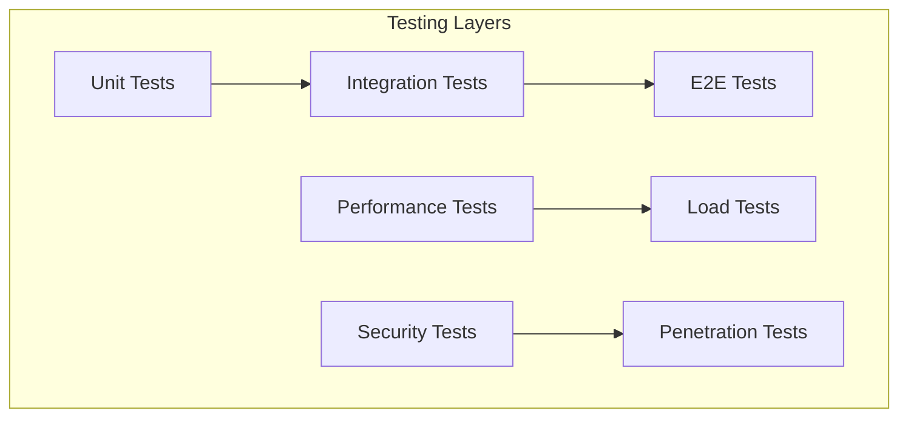
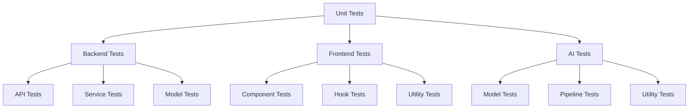
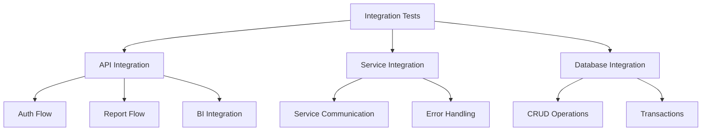
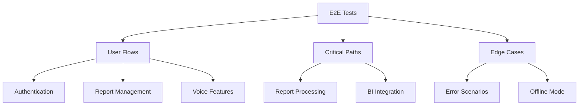
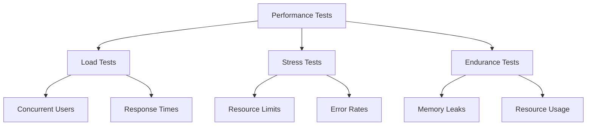
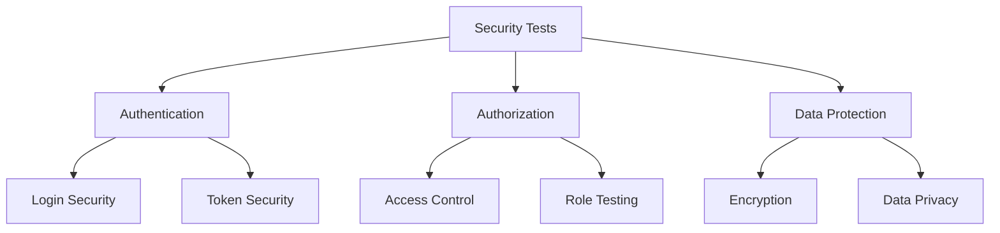
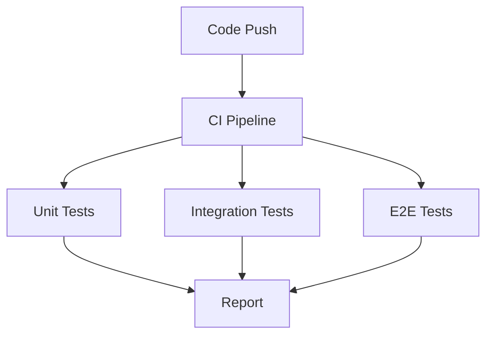
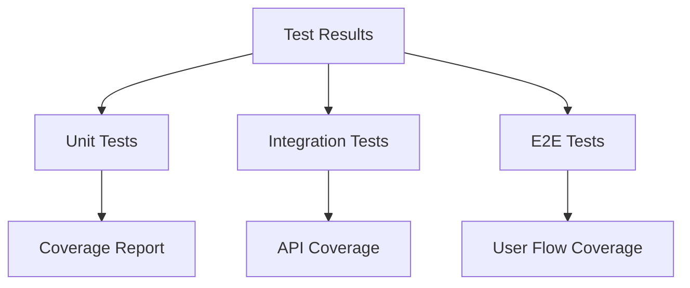
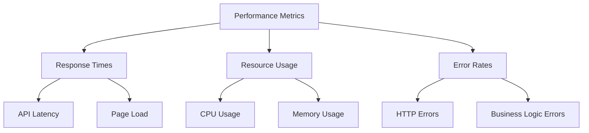

# Testing Guide

## Overview

This document outlines the testing strategy and procedures for the LexiReport application.

## Testing Architecture



## Test Types

### 1. Unit Tests



#### Backend Unit Tests

```python
# tests/unit/test_report_service.py
import pytest
from app.services.report import ReportService

def test_process_report():
    service = ReportService()
    result = service.process_report("test.pdf")
    assert result.status == "processed"
    assert result.insights is not None

def test_invalid_file():
    service = ReportService()
    with pytest.raises(ValueError):
        service.process_report("invalid.txt")
```

#### Frontend Unit Tests

```typescript
// tests/unit/ReportViewer.test.tsx
import { render, fireEvent } from '@testing-library/react';
import ReportViewer from '../../components/ReportViewer';

describe('ReportViewer', () => {
  it('renders report content', () => {
    const { getByText } = render(<ReportViewer report={mockReport} />);
    expect(getByText('Report Title')).toBeInTheDocument();
  });

  it('handles play button click', () => {
    const { getByRole } = render(<ReportViewer report={mockReport} />);
    fireEvent.click(getByRole('button', { name: /play/i }));
    // Assert audio playback started
  });
});
```

### 2. Integration Tests



#### API Integration Tests

```python
# tests/integration/test_api.py
import pytest
from fastapi.testclient import TestClient
from app.main import app

client = TestClient(app)

def test_report_upload():
    with open("test.pdf", "rb") as f:
        response = client.post(
            "/api/v1/reports/upload",
            files={"file": ("test.pdf", f, "application/pdf")}
        )
    assert response.status_code == 200
    assert response.json()["status"] == "processing"

def test_report_insights():
    response = client.get("/api/v1/reports/123/insights")
    assert response.status_code == 200
    assert "summary" in response.json()
```

### 3. End-to-End Tests



#### E2E Test Example

```typescript
// tests/e2e/report-flow.test.ts
import { test, expect } from '@playwright/test';

test('complete report flow', async ({ page }) => {
  // Login
  await page.goto('/login');
  await page.fill('[data-testid="email"]', 'test@example.com');
  await page.fill('[data-testid="password"]', 'password');
  await page.click('[data-testid="login-button"]');

  // Upload report
  await page.click('[data-testid="upload-button"]');
  await page.setInputFiles('input[type="file"]', 'test.pdf');
  await page.click('[data-testid="submit-upload"]');

  // Wait for processing
  await expect(page.locator('[data-testid="processing-status"]'))
    .toContainText('Processing complete');

  // Verify insights
  await expect(page.locator('[data-testid="insights"]'))
    .toContainText('Key Points');
});
```

### 4. Performance Tests



#### Load Test Example

```python
# tests/performance/test_load.py
import locust

class ReportUser(locust.HttpUser):
    @locust.task
    def upload_report(self):
        with open("test.pdf", "rb") as f:
            self.client.post(
                "/api/v1/reports/upload",
                files={"file": ("test.pdf", f, "application/pdf")}
            )

    @locust.task
    def get_insights(self):
        self.client.get("/api/v1/reports/123/insights")
```

### 5. Security Tests



#### Security Test Example

```python
# tests/security/test_auth.py
import pytest
from app.core.security import verify_password, create_access_token

def test_password_hashing():
    password = "test_password"
    hashed = hash_password(password)
    assert verify_password(password, hashed)
    assert not verify_password("wrong_password", hashed)

def test_token_security():
    token = create_access_token({"sub": "test@example.com"})
    assert verify_token(token)
    assert not verify_token("invalid_token")
```

## Test Environment Setup

### 1. Local Development

```bash
# Install test dependencies
pip install -r requirements-test.txt
npm install --save-dev @testing-library/react @playwright/test

# Run tests
pytest  # Backend tests
npm test  # Frontend tests
npm run test:e2e  # E2E tests
```

### 2. CI/CD Pipeline

```yaml
# .github/workflows/test.yml
name: Tests

on: [push, pull_request]

jobs:
  test:
    runs-on: ubuntu-latest
    steps:
      - uses: actions/checkout@v2
      
      - name: Set up Python
        uses: actions/setup-python@v2
        with:
          python-version: '3.8'
          
      - name: Install dependencies
        run: |
          pip install -r requirements-test.txt
          npm install
          
      - name: Run tests
        run: |
          pytest
          npm test
          npm run test:e2e
```

## Test Data Management

### 1. Test Fixtures

```python
# tests/fixtures/reports.py
import pytest

@pytest.fixture
def sample_report():
    return {
        "id": "test_123",
        "title": "Test Report",
        "content": "Test content",
        "type": "pdf"
    }

@pytest.fixture
def mock_insights():
    return {
        "summary": "Test summary",
        "key_points": ["Point 1", "Point 2"],
        "trends": ["Trend 1", "Trend 2"]
    }
```

### 2. Test Database

```python
# tests/conftest.py
import pytest
from app.db.session import SessionLocal
from app.db.base import Base

@pytest.fixture(scope="session")
def db():
    Base.metadata.create_all(bind=engine)
    db = SessionLocal()
    try:
        yield db
    finally:
        db.close()
        Base.metadata.drop_all(bind=engine)
```

## Test Coverage

### 1. Coverage Configuration

```ini
# .coveragerc
[run]
source = app
omit = 
    */tests/*
    */migrations/*
    */__init__.py

[report]
exclude_lines =
    pragma: no cover
    def __repr__
    raise NotImplementedError
```

### 2. Coverage Reports

```bash
# Generate coverage report
pytest --cov=app tests/
coverage html
```

## Test Automation

### 1. Automated Test Runs



### 2. Test Scheduling

```yaml
# .github/workflows/scheduled-tests.yml
name: Scheduled Tests

on:
  schedule:
    - cron: '0 0 * * *'  # Daily at midnight

jobs:
  test:
    runs-on: ubuntu-latest
    steps:
      - uses: actions/checkout@v2
      - name: Run tests
        run: |
          pytest
          npm test
```

## Test Reporting

### 1. Test Results



### 2. Performance Metrics



## Best Practices

1. **Test Organization**
   - Follow AAA pattern (Arrange, Act, Assert)
   - Use descriptive test names
   - Group related tests
   - Keep tests independent

2. **Test Data**
   - Use fixtures for common data
   - Clean up test data
   - Use realistic test data
   - Avoid hard-coded values

3. **Test Maintenance**
   - Regular test reviews
   - Update tests with code changes
   - Remove obsolete tests
   - Monitor test performance

4. **Test Documentation**
   - Document test scenarios
   - Explain complex test logic
   - Keep test documentation updated
   - Include test setup instructions

---

*See ARCHITECTURE.md for system diagrams and API_REFERENCE.md for endpoint details.* 