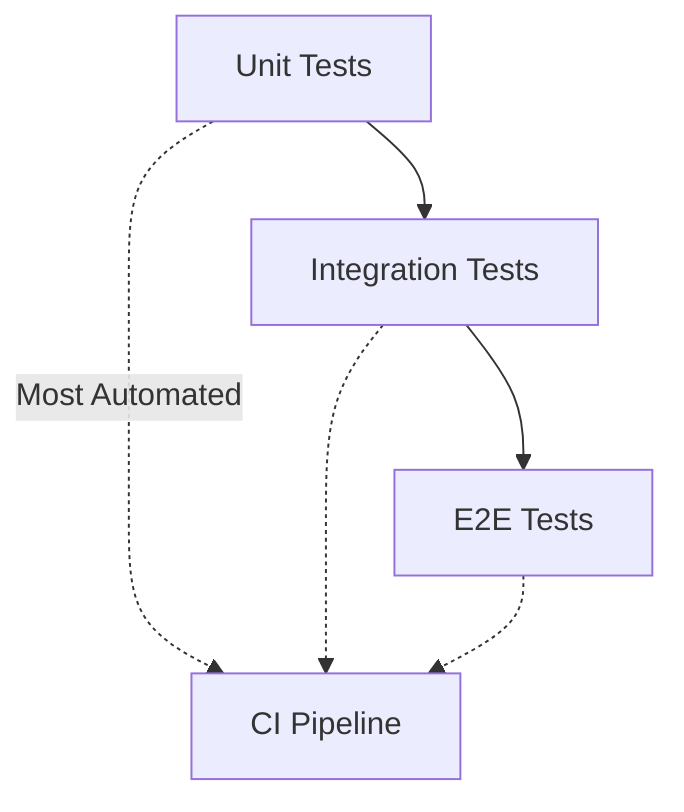

# Testing Documentation

## Test Environment Setup

### 1. Test Database Configuration

Create a `.env.test` file in the `backend` directory with the following configuration:

```env
# Database Configuration
POSTGRES_DB=test_lexireport
POSTGRES_USER=postgres
POSTGRES_PASSWORD=postgres
POSTGRES_SERVER=localhost
POSTGRES_PORT=5432

# JWT Configuration
JWT_SECRET_KEY=test_secret_key_123
ACCESS_TOKEN_EXPIRE_MINUTES=60

# Database Pool Settings
DB_POOL_SIZE=5
DB_MAX_OVERFLOW=10
DB_POOL_TIMEOUT=30
DB_POOL_RECYCLE=1800
DB_ECHO=true

# Redis Configuration
REDIS_HOST=localhost
REDIS_PORT=6379
REDIS_DB=1
REDIS_PASSWORD=
REDIS_SSL=false
REDIS_TIMEOUT=5
REDIS_RETRY_ON_TIMEOUT=true
```

### 2. Create Test Database

```bash
# Connect to PostgreSQL
psql -U postgres

# Create test database
CREATE DATABASE test_lexireport;

# Exit psql
\q
```

## Running Tests

### Basic Test Commands

```bash
# Navigate to backend directory
cd backend

# Run all tests
pytest

# Run tests with verbose output
pytest -v

# Run tests with coverage report
pytest --cov=app tests/

# Generate HTML coverage report
pytest --cov=app --cov-report=html tests/
```

### Running Specific Tests

```bash
# Run specific test file
pytest tests/test_auth_api.py -v

# Run specific test function
pytest tests/test_auth_api.py::test_register_user -v

# Run tests matching a pattern
pytest -k "test_register" -v
```

## Test Structure

### Test Files

- `tests/conftest.py`: Contains test fixtures and configuration
- `tests/test_auth_api.py`: Authentication endpoint tests
- `tests/test_user_api.py`: User management endpoint tests

### Test Fixtures

The test suite includes several fixtures:

1. `setup_test_db`: Session-scoped fixture that:
   - Resets the test database
   - Seeds initial test data
   - Cleans up after all tests

2. `db_session`: Function-scoped fixture that:
   - Creates a new database session
   - Wraps tests in transactions
   - Rolls back changes after each test

3. `client`: Function-scoped fixture that:
   - Creates a test client
   - Overrides database session
   - Cleans up after each test

4. `test_user`: Function-scoped fixture that:
   - Creates a test user with basic permissions
   - Email: test@example.com
   - Password: StrongP@ssw0rd123
   - Permissions: api_access, read_users, write_users

5. `test_admin`: Function-scoped fixture that:
   - Creates an admin user with all permissions
   - Email: admin@example.com
   - Password: StrongP@ssw0rd123
   - Permissions: api_access, read_users, write_users, manage_users

## Test Database Management

### Reset Test Database

The test database is automatically reset before running tests. This is handled by the `setup_test_db` fixture in `conftest.py`.

### Seed Test Data

Initial test data is seeded automatically through the `setup_test_db` fixture. This includes:
- Default permissions
- Test users
- Admin user

## Best Practices

1. **Isolation**: Each test runs in its own transaction that is rolled back after completion
2. **Fixtures**: Use the provided fixtures instead of creating new database connections
3. **Cleanup**: Tests should clean up after themselves, but the framework provides automatic cleanup
4. **Coverage**: Aim for high test coverage, especially for critical paths
5. **Naming**: Follow the naming convention `test_*` for test functions

## Troubleshooting

### Common Issues

1. **Database Connection Errors**
   - Ensure PostgreSQL is running
   - Verify database credentials in `.env.test`
   - Check if test database exists

2. **Test Failures**
   - Check test logs for detailed error messages
   - Verify test database state
   - Ensure all required services are running

3. **Coverage Issues**
   - Run with `--cov=app` to see coverage report
   - Use `--cov-report=html` for detailed HTML report
   - Check `htmlcov/index.html` for coverage details

### Debugging Tests

```bash
# Run tests with print statements enabled
pytest -s

# Run tests with debugger
pytest --pdb

# Run tests with detailed traceback
pytest -vv
```

## Test Strategy Overview

LexiReport uses a layered testing approach for both backend and frontend, with automated CI and coverage tracking.

## Test Pyramid



- **Unit Tests**: Core logic, models, utilities (Jest, Pytest)
- **Integration Tests**: API endpoints, DB, services (Pytest, Supertest)
- **E2E Tests**: Full user flows (Detox, Playwright)

## Automation & Coverage
- All tests run in CI (GitHub Actions)
- Coverage reports generated for backend and frontend
- Aim for >90% coverage on core logic and endpoints

## Achievements
- ✅ Automated test suite for backend (Pytest)
- ✅ Automated test suite for frontend (Jest/React Native Testing Library)
- ✅ E2E tests for critical user flows
- ✅ High coverage on core features

## Best Practices
- Isolate tests, use fixtures for DB
- Clean up after each test
- Use descriptive test names
- Review coverage reports regularly

---

*See ARCHITECTURE.md for system diagrams and API_REFERENCE.md for endpoint details.* 